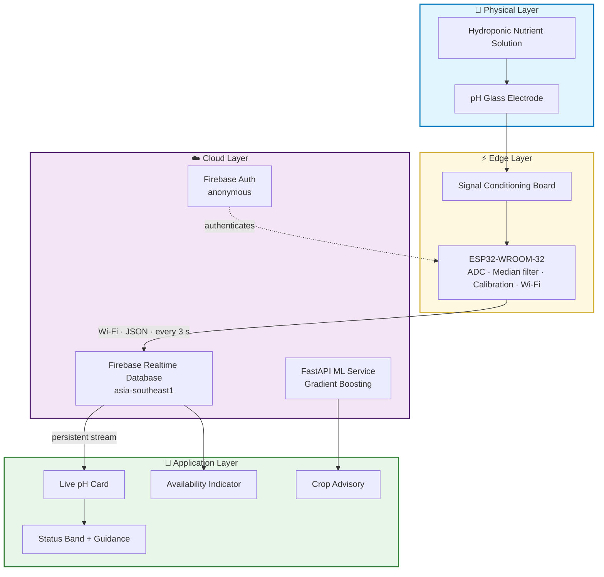
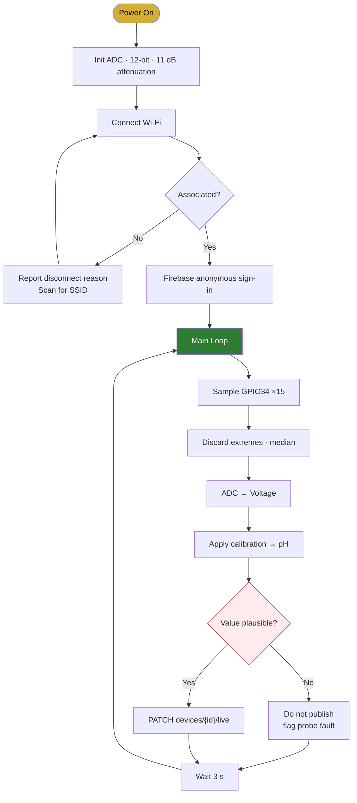
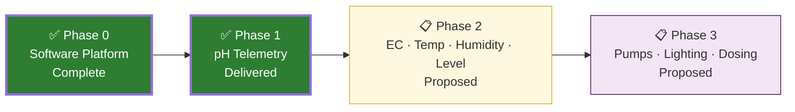

# Prompt: Build the Hydro Smart Project Completion Report

Paste everything below into a new chat.

---

You are writing a **final-year project completion report** for an academic
submission. Produce it as a **polished, designed document**.

**Project:** Hydro Smart — AI-Assisted Hydroponics Management with Live IoT
pH Monitoring
**Audience:** academic evaluators and technical reviewers
**Tone:** factual and measured. Do not inflate. Where something is
incomplete, say so plainly — the report's credibility depends on it.

**Design:** title page, contents, clear section hierarchy, styled tables,
rendered diagrams, status badges (Complete / Partial / Outstanding).
Palette: primary green `#2E7D32`, golden wheat `#D4AF37`, deep soil
`#1B3A1F`, parchment `#FDF4E3`. Render every ```mermaid block as a diagram.

Keep all numbers, pin assignments and figures below **exactly as written** —
they are measured values, not estimates.

---

## 1. What the system is

An Android application (Flutter 3.44.8 / Dart 3.12.2) for small and medium
Indian hydroponic growers, combining crop advisory, financial planning,
market intelligence, government subsidy discovery and an AI assistant, now
extended with a live IoT sensing node built on ESP32 that streams
nutrient-solution pH to the phone in real time.

| Item | Detail |
|---|---|
| Platform | Android · Flutter 3.44.8 · Dart 3.12.2 |
| State management | Riverpod |
| Backend | Firebase Auth, Cloud Firestore, Realtime Database (asia-southeast1) |
| ML service | FastAPI + scikit-learn, hosted on Render |
| Hardware | ESP32-WROOM-32 + Gravity analog pH probe |
| Repository | github.com/deba310984/hydro_smart |
| Release build | app-release.apk · 68.4 MB · v1.0.0 |
| Test device | Pixel 6 emulator · Android 14 (API 34) |

---

## 2. Verified application modules

All verified by direct on-device interaction — screens opened, controls
operated, values entered, results observed. Not by code inspection.

**Authentication & onboarding** — animated splash; email/password sign-in via
Firebase Auth with persistent session; demo mode; bilingual English/Hindi
toggle throughout; eleven-step guided tutorial with mascot in both languages.

**Dashboard** — live mandi price ticker carrying domestic APMC and global
commodity feeds (e.g. Tomato ₹38.0 at Azadpur Mandi, Corn $0.21); live pH
card; six-module feature grid with Warli-art styling; navigation drawer.

**Crop Advisor** — GPS fix and live weather from Open-Meteo (verified:
17.2 °C, 87 % humidity, resolved to Mountain View, California); ML
recommendation request returning in ~0.9 s; recommendation list with risk
level, duration, profit and water demand; filter panel covering hydroponic
technique, growing season, duration, profit margin, difficulty and market
demand; offline fallback to a bundled dataset when the service is
unreachable; crop detail page with ROI, margin, yield, break-even and
twelve-month revenue/cost charts.

**Marketplace** — 37 products across six categories; price filters; vendor
badges, ratings and discounts; external retailer redirection with error
handling.

**Finance Hub** — five tabs: overview, taxation, loan/EMI, ROI, budget.

**Subsidies** — eight central schemes with eligibility, required documents,
ministry and deadline; subsidy calculator with arithmetic verified
(₹100,000 at 60 % → ₹60,000 subsidy, ₹40,000 net cost); official portal
links.

**AI Assistant** — retrieval-augmented chat over a Firestore knowledge base;
degrades gracefully with clear setup guidance when no API key is configured,
rather than crashing.

**Growth Tracker** — empty state with routing into crop advisory.

---

## 3. Machine-learning subsystem

A baseline was measured *before* any change. Three model families were then
benchmarked across two feature sets and seven hyper-parameter settings.

| Metric | Before | After | Change |
|---|---|---|---|
| Held-out accuracy | 81.9 % | **87.6 %** | +5.7 points |
| Cross-validation | 82.1 % ± 0.44 | **87.5 % ± 0.13** | 3× more stable |
| Deployed artifact | 547 MB | **26.7 MB** | ~20× smaller |
| Training samples | 30,000 | 150,000 | 5× |

**What produced the gain:**

1. **Algorithm change** — random forest → histogram-based gradient boosting.
   Largest single contributor, and it also fixed a deployment failure: the
   forest serialised to 547 MB, over the 512 MB hosting limit, causing
   repeated out-of-memory errors.
2. **Physics-derived features** from the same four inputs the app already
   sends. **Vapour pressure deficit** — the dominant driver of transpiration
   and nutrient uptake in controlled-environment growing — ranked *above raw
   temperature* by permutation importance (0.110 vs 0.075).
3. **Dead feature removal** — squared temperature and squared humidity
   measured at exactly 0.0000 importance; removed with no accuracy cost.
4. **Unknown-location fix** — locations outside the training set were mapped
   to whichever Indian state sorted first alphabetically, so "California" was
   modelled as coastal Andhra Pradesh and returned Chili Pepper (a 23–35 °C
   crop) at 17 °C. Predictions now marginalise over all known locations.

**Honest ceiling:** the limit is label ambiguity, not model capacity. At
22 °C / 60 % / April, four crops are all legitimately correct, so a
single-label formulation cannot exceed roughly 88 % regardless of algorithm.

---

## 4. IoT pH subsystem — delivered scope

### Bill of materials

| # | Component | Function |
|---|---|---|
| 1 | ESP32-WROOM-32 DevKit | Microcontroller with 2.4 GHz Wi-Fi |
| 2 | Gravity analog pH module | Signal conditioning and amplification |
| 3 | Glass pH electrode (BNC) | Measures hydrogen-ion activity |
| 4 | Breadboard, jumper wires | Prototyping interconnect |
| 5 | USB cable | Power and programming |
| 6 | pH 4.00 / 6.86 / 9.18 buffers | Calibration and verification |

### Wiring

| Module pin | ESP32 pin | Note |
|---|---|---|
| VCC | **VIN (5 V)** | Board requires 5 V; at 3.3 V the output saturates |
| GND | GND | Shared ground mandatory for a stable reference |
| AO | **GPIO34** | ADC1 channel |
| DO | not connected | Digital threshold output, unused |

**GPIO34 is a design requirement, not a preference.** ADC2 channels are
disabled by the silicon whenever Wi-Fi is active, so a sensor on ADC2 reads
correctly on the bench and fails silently the moment the device joins a
network.

### Firmware behaviour

- Median filtering across 15 samples, extremes discarded — a raw ADC
  conversion is too noisy to publish
- Two-point calibration mapping voltage → pH
- Validity gating so a dry or detached electrode does not publish nonsense
- **Indefinite Wi-Fi retry instead of a reboot loop** — phone hotspots sleep
  when idle, and a rebooting device kept missing the wake window
- **Driver-level disconnect reason reporting** — distinguishes a wrong
  passphrase from an absent access point, conditions needing entirely
  different fixes that otherwise present identically
- Anonymous Firebase authentication, so database rules can require an
  authenticated principal without embedding a long-lived secret in firmware
- Server-assigned timestamps, since the microcontroller has no RTC
- Credentials in a gitignored `secrets.h`, with `secrets.example.h` committed

### Data contract

Published to `devices/{deviceId}/live`:

```json
{ "ph": 6.42, "voltage": 1.512, "rssi": -63,
  "firmware": "1.0.0", "updatedAt": 1788379163588 }
```

Forward-compatible: the client already parses `temperature`, `humidity`,
`ec` and `waterLevel`, so new sensors need only a firmware change.

### Application presentation

| Element | Behaviour |
|---|---|
| Numeric reading | Two decimals, colour-coded by band |
| Status band | Acidic < 5.5 · **Optimal 5.5–6.5** · Slightly alkaline ≤ 7.5 · Alkaline > 7.5 |
| Corrective guidance | States the required intervention |
| Freshness | Relative age, updated each second |
| Availability | Marks device offline after 60 s of silence |
| Pairing | Device ID entered once, stored locally |

**Design note worth highlighting:** silence is treated as information. Because
the node publishes on a fixed interval, a gap is itself evidence the device
lost power, network or halted — so the interface reports that rather than
displaying a stale value as though current.

---

## 5. Verification results

The node associated with the network, obtained IP **10.73.244.32**,
authenticated anonymously against Firebase, and published every 3 s.
Repeated independent database reads returned record ages of **1–3 s**,
confirming sustained live publication rather than one stale write. The app
displayed the value with an online indicator reading "Just now" across
observations 20 s apart.

| Chain element | Status | Evidence |
|---|---|---|
| App live card + pairing | ✅ Verified | Value rendered and updating on device |
| Firebase authentication | ✅ Verified | Anonymous sign-in succeeds |
| Database security rules | ✅ Verified | Authenticated read 200; unauthenticated 401 |
| ESP32 network association | ✅ Verified | IP assigned, RSSI −63 dBm |
| ESP32 → cloud publication | ✅ Verified | Record age sustained 1–3 s |
| Probe analog front end | ⚠️ Partial | Intermittent — see Limitations |
| Two-point calibration | ❌ Outstanding | Requires buffer solutions |

### Defects found and fixed (7)

| # | Severity | Defect | Resolution |
|---|---|---|---|
| 1 | Blocker | App would not compile — a page-transition class moved between framework libraries in Flutter 3.44 | Corrected imports |
| 2 | Critical | Recommendation service targeted `localhost` only, failing on every real device | Added cloud fallback |
| 3 | Critical | No `databaseURL` configured — Realtime Database could never connect | Added regional URL for all platforms |
| 4 | Critical | `[core/duplicate-app]` crash: Android's native SDK initialises before Dart | Guarded initialisation |
| 5 | Major | Marketplace data character-corrupted by UTF-8 double encoding (emoji rendered as `🥬`) | Repaired encoding across the file |
| 6 | Major | Financial chart axis displayed every value as `₹0k` | Adaptive currency formatting |
| 7 | Moderate | Dashboard header overlapped its own tab bar and back button | Corrected layout metrics |

A card displaying fabricated soil pH, moisture and N-P-K figures was also
removed — those values could not originate from any sensor in the design, and
showing them beside genuine telemetry would have misrepresented the system.

---

## 6. Limitations — state these plainly

- **Calibration incomplete.** Firmware carries placeholder constants, so the
  reported pH is not yet metrologically valid. The transport chain is proven;
  the absolute accuracy of the number is not.
- **Analog front end intermittent.** The conditioned output has been observed
  both responding correctly and saturating at the supply rail, indicating an
  unreliable physical connection still to be resolved.
- **Nutrient concentration not measured.** pH alone does not characterise a
  solution; electrical conductivity is needed to distinguish a balanced
  solution from a depleted one at the same pH.
- **Recommendation accuracy bounded** by label ambiguity (Section 3).
- **Release signed with debug keys** — suitable for demonstration and
  sideloading, not public distribution.
- **No store-and-forward buffer** — readings during a network outage are lost.

---

## 7. Future work — pH sensing is the delivered scope

Everything below is **proposed, not delivered**. Order reflects dependency.

**7.1 Completing the pH subsystem**
- Two-point calibration against certified pH 6.86 and 4.00 buffers, verified
  at 9.18, with a documented recalibration interval (2–4 weeks; glass
  electrodes drift as they age)
- Replace breadboard interconnect with soldered or terminal-block
  connections to remove the intermittent contact
- Temperature compensation — pH is temperature-dependent and currently
  uncompensated
- Local buffering during outages with backfill on reconnection

**7.2 Additional sensing parameters** — the data contract and client parser
already accommodate these fields:

| Parameter | Interface | Capability enabled |
|---|---|---|
| Electrical conductivity | Analog | Nutrient concentration — natural companion to pH |
| Water temperature | 1-Wire (DS18B20) | Root-zone management and pH compensation |
| Air temperature / humidity | Digital (DHT22) | Canopy climate; VPD from measurement, not forecast |
| Water level | Analog / ultrasonic | Reservoir depletion alerting |

**7.3 Closed-loop automation**
- Relay-driven circulation pump control
- Photoperiod control for supplementary lighting
- Automatic pH dosing — **requires 7.1 as a safety precondition**: an
  uncalibrated sensor driving a dosing pump would actively damage a crop

**7.4 Analytical extensions**
- Historical trend visualisation and anomaly detection
- Retraining the recommendation model on measured on-site data, expected to
  outperform any public dataset because it matches deployment conditions
- Threshold alerting by push notification

---

## 8. Research contribution

- An integrated architecture combining advisory intelligence with live
  environmental telemetry in one mobile application aimed at small and
  medium Indian growers
- Demonstration that **vapour pressure deficit**, derived from inputs already
  available to the app, is materially more informative than raw temperature
  for climate-conditioned crop recommendation
- A deployment result of practical significance: substituting gradient
  boosting for a random forest cut the artifact 20× *while improving
  accuracy*, converting a service that exceeded its hosting memory limit into
  one that operates inside it
- A telemetry design treating absence of data as a reportable state rather
  than silently rendering continuity — a correctness property that matters
  for any system a grower relies on

---

## 9. Diagrams to render







---

## 10. Structure to follow

Abstract · 1 Introduction (context, problem statement, proposed solution) ·
2 Objectives · 3 System Architecture · 4 Implementation and Verified
Functionality · 5 Machine-Learning Subsystem · 6 IoT pH Monitoring Subsystem ·
7 Results and Verification · 8 Limitations · 9 Future Work · 10 Research
Contribution · 11 Conclusion · References

Close with: *"All measurements, accuracy figures, pin assignments and status
claims stated in this document were observed during testing or are explicitly
identified as outstanding."*
