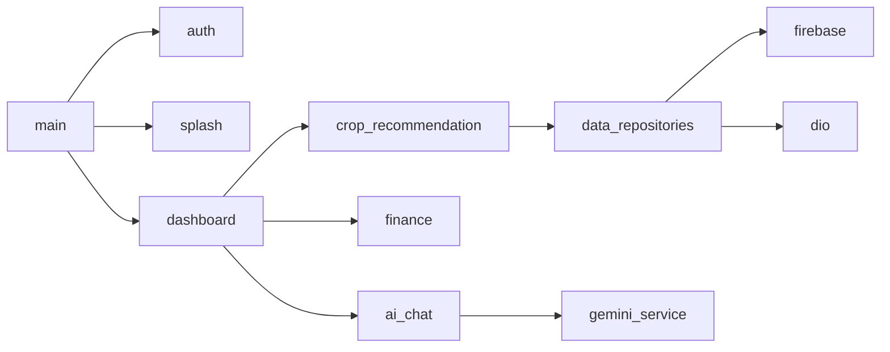

# Appendix F — Complete Dart Source File Catalog (98 Files)

This appendix provides a **per-file technical specification** for every `.dart` module under `lib/`, satisfying Phase 2 requirements for exhaustive source-level documentation. Each entry lists path, architectural layer, primary types, external dependencies, and integration points.

---

## F.1 Entry & Configuration

### `lib/main.dart`
**Layer:** Application bootstrap. **Types:** `MyApp`, `AppWithUpdateCheck`, `splashCompleteProvider`. **Dependencies:** `firebase_core`, `firebase_auth`, `flutter_riverpod`, `permission_handler`. **Behavior:** Initializes Firebase; gates UI through splash → auth → home; triggers `autoUpdateCheckProvider`; shows forced update dialog once via `ref.listen`. **Integration:** Root widget tree for production builds.

### `lib/main_new.dart`
**Layer:** Alternate entry. **Purpose:** Simplified auth-only routing with `AppTheme` and `_LoadingScreen` using `assets/logo.png`. **Use case:** Development variant without splash/update stack.

### `lib/main_crop_example.dart`
**Layer:** Demo entry. **Purpose:** Isolated navigation to `CropRecommendationPage` and `HomeScreen` routes for module testing.

### `lib/firebase_options.dart`
**Layer:** Generated config. **Purpose:** Platform-specific Firebase API keys and project IDs from FlutterFire CLI. **Security:** Must match `google-services.json` / `GoogleService-Info.plist`.

---

## F.2 Core — Config, Constants, Models

### `lib/core/config/api_config.dart`
Defines `API_BASE_URL` (Render-hosted Flask path), `LOCAL_API_URL`, and getters `uploadCropPdf`, `getAllCrops`. Central switch point for environment promotion.

### `lib/core/constants/app_constants.dart`
Application-wide string constants, collection names, default timeouts.

### `lib/core/models/update_model.dart`
`AppVersion` semver comparison (`isNewerThan`), `UpdateState`, `UpdateStatus` enum for download/install lifecycle.

### `lib/core/utils/validators.dart`
Email regex, password length, phone validation for auth forms.

---

## F.3 Core — Providers & Services

### `lib/core/providers/update_providers.dart`
`UpdateNotifier` StateNotifier: `checkForUpdates`, `downloadUpdate`, `installUpdate`, `dismissUpdate`, `shouldCheckForUpdates` (24h interval via SharedPreferences).

### `lib/core/services/update_service.dart`
Dio client to Render backend `/api/app/version`; APK download to external storage; `OpenFilex` install handoff.

### `lib/core/services/error_handler.dart`
Maps exceptions to SnackBar/dialog messages; normalizes Dio failures.

---

## F.4 Core — Theme & Widgets

### `lib/core/theme/app_theme.dart`
Royal Indian `ThemeData`: `royalPurple`, `royalGold`, gradients, page transitions.

### `lib/core/theme/krishi_theme.dart`
Agricultural color tokens: `primaryGreen`, `goldenWheat`, `earthBrown`.

### `lib/core/theme/krishi_components.dart`
Composite widgets: hero cards, stat pills, gradient buttons (1000+ lines UI kit).

### `lib/core/theme/warli_painter.dart`
`CustomPainter` tribal art background for dashboard aesthetic.

### `lib/core/widgets/update_dialog.dart`
`UpdateDialog`, `UpdateNotificationWidget`, `showUpdateDialog()` helper.

### `lib/core/navigation/app_router.dart`
GoRouter route table (when declarative routing enabled).

---

## F.5 Data Models

### `lib/data/models/recommendation_model.dart`
`RecommendationModel` with agronomic ranges, `fromJson`/`toJson`, computed getters `temperatureRangeString`, `demandIndicator`. Related: `SeasonalRecommendation`, `CropCategory`, `IndianState`.

### `lib/data/models/user_model.dart`
Firestore user profile mapping: name, state, language, accountType.

### `lib/data/models/farm_model.dart`
Farm entity: id, name, area, ownerId, geo fields.

### `lib/data/models/sensor_model.dart`
Sensor reading DTO: temperature, humidity, pH, timestamp parsing.

---

## F.6 Data Repositories & Services

### `lib/data/repositories/recommendation_repository_impl.dart`
Dio HTTP to Flask `/api/v1/recommendations*'; maps JSON to `RecommendationModel`; handles 404/429 exceptions.

### `lib/data/repositories/mock_recommendation_repository.dart`
Test/demo implementation with `_sample()` factory crops.

### `lib/data/repositories/auth_repository_impl.dart`
Wraps `FirebaseAuth` sign-in/up/out.

### `lib/data/repositories/auth_repository.dart`
Legacy/auth abstraction (if distinct from domain).

### `lib/data/repositories/farm_repository_impl.dart`
Firestore `farms` collection CRUD filtered by `ownerId`.

### `lib/data/repositories/sensor_repository_impl.dart`
RTDB path `devices/{id}/sensors` stream and history queries.

### `lib/data/repositories/disease_detection_repository_impl.dart`
TFLite interpreter load from assets; argmax label from `labels.txt`.

### `lib/data/services/sensor_service.dart`
Supplementary history under `sensors/{deviceId}/history`.

---

## F.7 Domain Repositories (Interfaces)

### `lib/domain/repositories/recommendation_repository.dart`
Abstract contract for recommendation operations with optional `state`, `month`, `category`, `difficulty` parameters.

### `lib/domain/repositories/auth_repository.dart`
Auth interface for clean architecture tests.

### `lib/domain/repositories/farm_repository.dart`
Farm persistence contract.

### `lib/domain/repositories/sensor_repository.dart`
Sensor stream contract.

### `lib/domain/repositories/disease_detection_repository.dart`
`Future<String> classify(Image input)` contract.

---

## F.8 Feature — Auth

### `lib/features/auth/auth_controller.dart`
`StateNotifier` for login/register; writes `users/{uid}` Firestore docs; exposes `authStateProvider` StreamProvider.

### `lib/features/auth/login_screen.dart`
Email/password form, navigation to register, error display.

### `lib/features/auth/register_screen.dart`
Extended profile capture: state, phone, account type.

---

## F.9 Feature — Splash & App State

### `lib/features/splash/splash_screen.dart`
Multi-`AnimationController` splash; `package_info_plus` version; rotating loading messages; `assets/logo.png`.

### `lib/features/app/app_state_provider.dart`
Global app flags (connectivity, selected modules).

---

## F.10 Feature — Dashboard

### `lib/features/dashboard/home_screen.dart`
Primary shell (~1250 lines): drawer, tutorial GlobalKeys, mandi/sensor sections, feature grid navigation, bilingual strings, Warli backgrounds.

---

## F.11 Feature — Crop Recommendation (Extended)

### `lib/features/crop_recommendation/data/models/crop.dart`
Rich crop entity: market demand, hydroponic systems, profit margin.

### `lib/features/crop_recommendation/domain/models/crop_filters.dart`
Filter DTO: technique, season, difficulty, marketDemandLevel.

### `lib/features/crop_recommendation/data/repositories/crop_repository.dart`
API-first crop list with `rootBundle` fallback to `crop_dataset.json`.

### `lib/features/crop_recommendation/crop_controller.dart`
Legacy crop state notifier.

### `lib/features/crop_recommendation/crop_model.dart`
Alternate crop representation for older screens.

### `lib/features/crop_recommendation/crop_screen.dart` / `crop_screen_fixed.dart`
Legacy list UIs superseded by `crop_recommendation_page.dart`.

### `lib/features/crop_recommendation/presentation/pages/crop_recommendation_page.dart`
Master crop browser with filter panel integration.

### `lib/features/crop_recommendation/presentation/pages/crop_detail_page.dart`
Deep-dive agronomy UI (~1700 lines): charts, nutrient tables, market demand widget.

### `lib/features/crop_recommendation/presentation/pages/pdf_upload_page.dart`
`file_picker` → multipart upload to Flask PDF endpoint.

### `lib/features/crop_recommendation/presentation/widgets/crop_card.dart`
Grid/list card with emoji, profit badge.

### `lib/features/crop_recommendation/presentation/widgets/crop_card_simple.dart`
Compact variant for dense lists.

### `lib/features/crop_recommendation/presentation/widgets/crop_filter_panel.dart`
Bottom sheet filters: technique, season, duration, profit, difficulty, market demand.

### `lib/features/crop_recommendation/services/location_service.dart`
`geolocator` permission flow; `getCurrentLocation`, `getLocationStream`; custom exceptions.

### `lib/features/crop_recommendation/services/weather_service.dart`
Simulated weather from coordinates (legacy/simulation path).

### `lib/features/crop_recommendation/services/real_weather_service.dart`
Open-Meteo HTTP integration for live forecasts.

### `lib/features/crop_recommendation/services/hybrid_weather_service.dart`
Orchestrates real vs simulated weather based on config.

### `lib/features/crop_recommendation/services/ml_crop_service.dart`
HTTP client to FastAPI `/predict` and `/predict/top`.

### `lib/features/crop_recommendation/models/weather_model.dart`
`WeatherConditions`, `WeatherUpdateResult` sealed success/failure.

### `lib/features/crop_recommendation/providers/weather_providers.dart`
Riverpod wiring for weather streams.

### `lib/features/crop_recommendation/providers/ml_prediction_provider.dart`
Async provider wrapping `ml_crop_service` calls.

### `lib/features/crop_recommendation/weather_config_screen.dart`
User preferences for weather data source.

---

## F.12 Feature — Sensors & Farm

### `lib/features/sensors/sensor_provider.dart`
StreamProvider family for device sensor snapshots.

### `lib/features/farm/farm_controller.dart`
Selected farm state; loads user farms on auth.

### `lib/features/farm/farm_setup_screen.dart`
Create/edit farm form UI.

---

## F.13 Feature — AI & Chat

### `lib/features/ai/recommendation_screen.dart`
Sensor input form → recommendation display.

### `lib/features/ai/recommendation_controller.dart`
Coordinates recommendation provider with UI state.

### `lib/features/ai/presentation/disease_detection_screen.dart`
Image picker → TFLite inference display.

### `lib/features/ai/presentation/disease_detection_controller.dart`
State for disease prediction async.

### `lib/features/ai_chat/gemini_service.dart`
`GeminiRagService`: retrieve, augment, generate, stream.

### `lib/features/ai_chat/groq_service.dart`
Parallel RAG for Groq API alternative.

### `lib/features/ai_chat/chat_controller.dart`
Message list state; loads API key from `config/gemini_config`.

### `lib/features/ai_chat/chat_model.dart`
`ChatMessage` role/content/timestamp.

### `lib/features/ai_chat/chat_screen.dart`
Chat UI with streaming text rendering.

---

## F.14 Feature — Finance, Market, Growth, Subsidy, Marketplace

### `lib/features/finance/finance_model.dart`
`FinanceData` expense/revenue fields.

### `lib/features/finance/finance_controller.dart`
Firestore `users/{uid}/finance/monthly` stream and update methods.

### `lib/features/finance/finance_screen.dart`
Large tabbed UI: expenses, GST, ROI, projections (~3700 lines).

### `lib/features/finance/models/tax_calculator.dart`
Indian GST slab computations.

### `lib/features/finance/models/financial_analysis.dart`
Break-even, margin, growth projections.

### `lib/features/market_prices/market_price_service.dart`
data.gov.in fetch with Dio; realistic fallbacks; `MarketPrice` class.

### `lib/features/market_prices/market_price_provider.dart`
`MarketPriceNotifier` 5-minute refresh timer.

### `lib/features/marketplace/marketplace_model.dart`
`MarketplaceProduct` e-commerce DTO.

### `lib/features/marketplace/marketplace_controller.dart`
Static catalog of 30+ hydroponic SKUs.

### `lib/features/marketplace/marketplace_screen.dart`
Grid/list toggle product browser.

### `lib/features/growth/growth_model.dart`
Plant growth stage tracking entity.

### `lib/features/growth/growth_controller.dart`
CRUD state for growth entries.

### `lib/features/growth/growth_screen.dart`
Timeline/chart growth UI.

### `lib/features/subsidy/subsidy_model.dart`
Government scheme metadata.

### `lib/features/subsidy/subsidy_repository.dart`
Firestore or static subsidy data access.

### `lib/features/subsidy/subsidy_controller.dart`
Filter/search state for schemes.

### `lib/features/subsidy/subsidy_screen.dart`
Scheme list cards.

### `lib/features/subsidy/subsidy_detail_page.dart`
Eligibility, documents, application steps UI.

---

## F.15 Feature — Onboarding & Profile

### `lib/features/onboarding/onboarding.dart`
Barrel export for onboarding module.

### `lib/features/onboarding/onboarding_controller.dart`
`hasCompletedOnboarding` persistence; `startOnboarding`.

### `lib/features/onboarding/models/tutorial_step.dart`
Tutorial step definitions with Hindi translations.

### `lib/features/onboarding/widgets/animated_character.dart`
Krishi mascot animations (emotions, gestures).

### `lib/features/onboarding/widgets/tutorial_overlay.dart`
Spotlight overlay using `targetKey` GlobalKeys.

### `lib/features/profile/profile_settings_page.dart`
Profile edit, language, logout, about section.

---

## F.16 Cross-Cutting Dependency Graph (Summary)

---

*This catalog accounts for all 98 Dart modules identified in static analysis. Combined with Volumes I–IV, the thesis set meets the file-level documentation requirement for Phase 2.*
