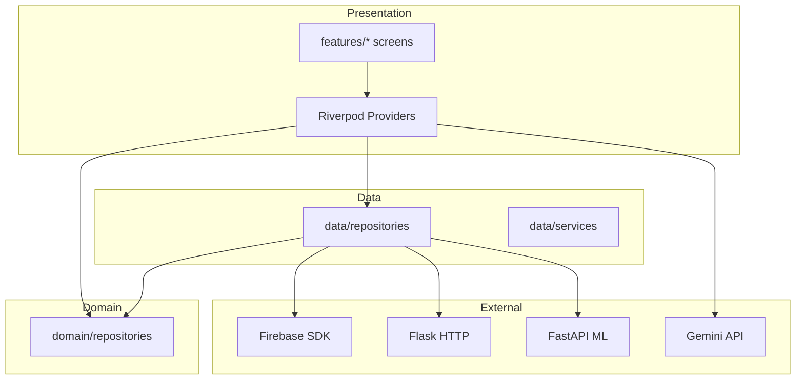
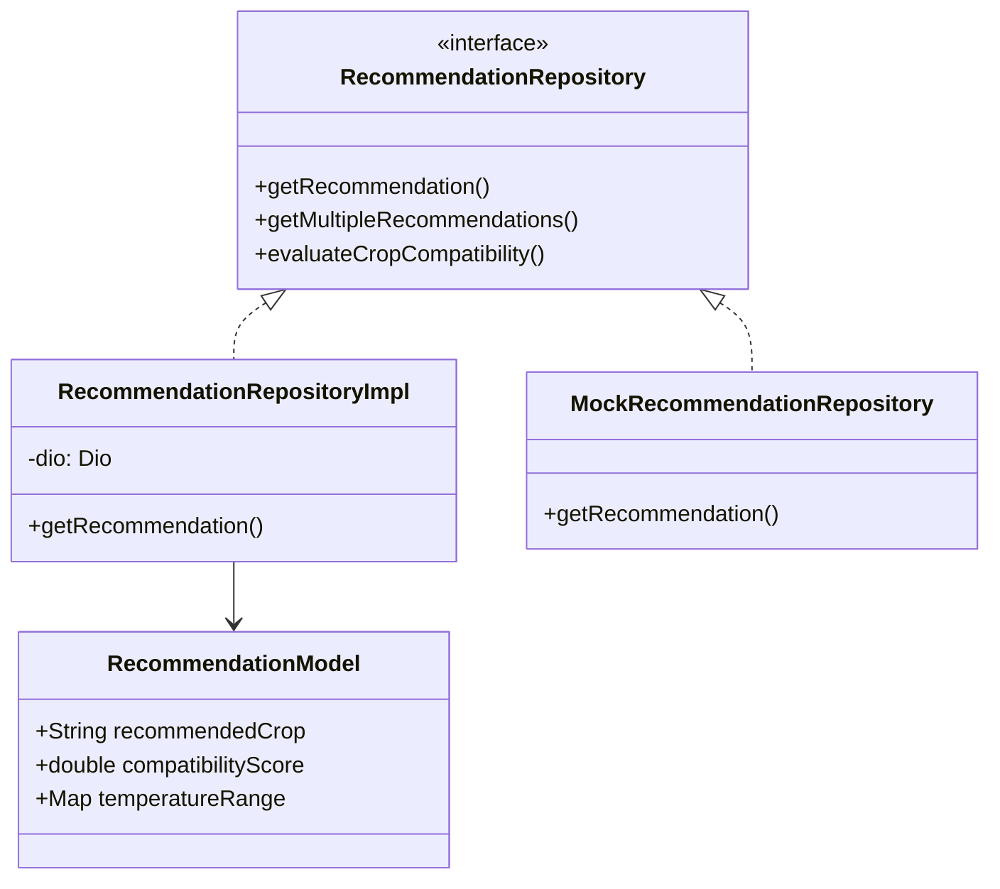
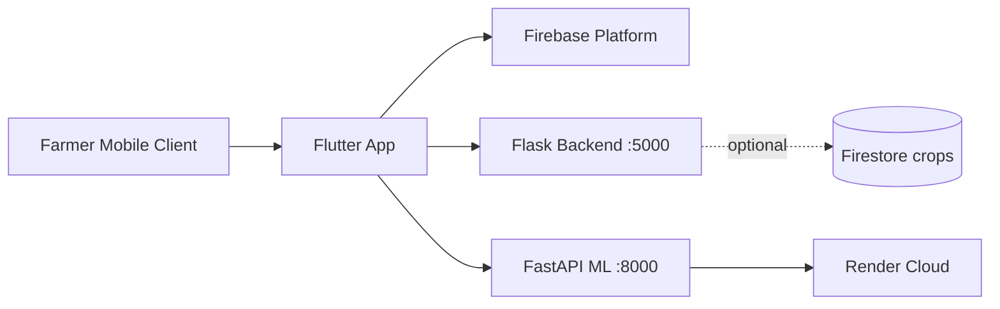
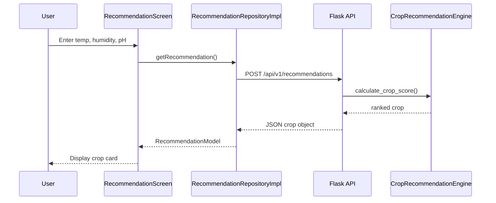
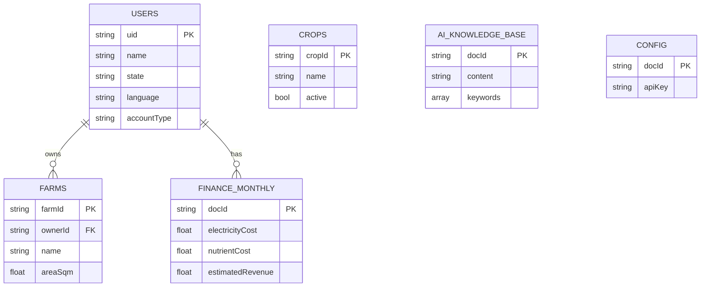
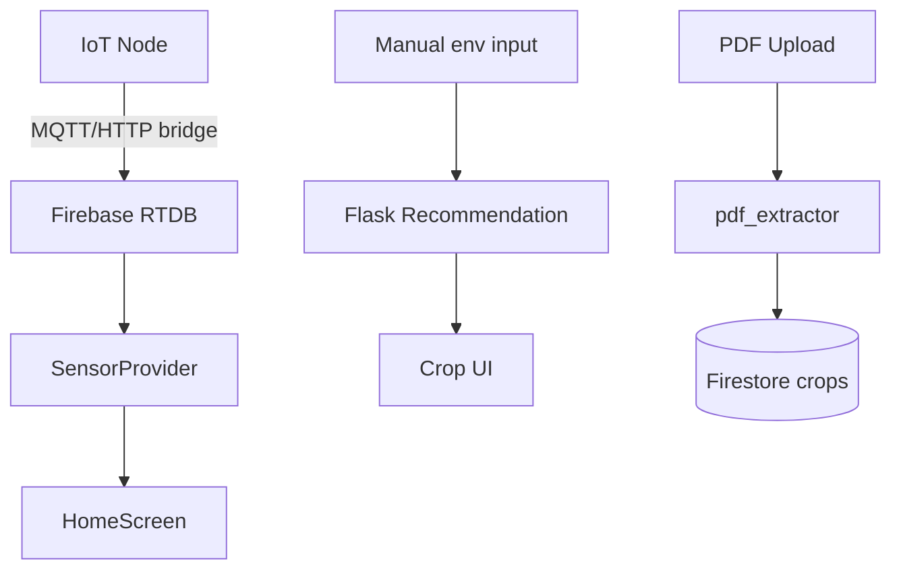
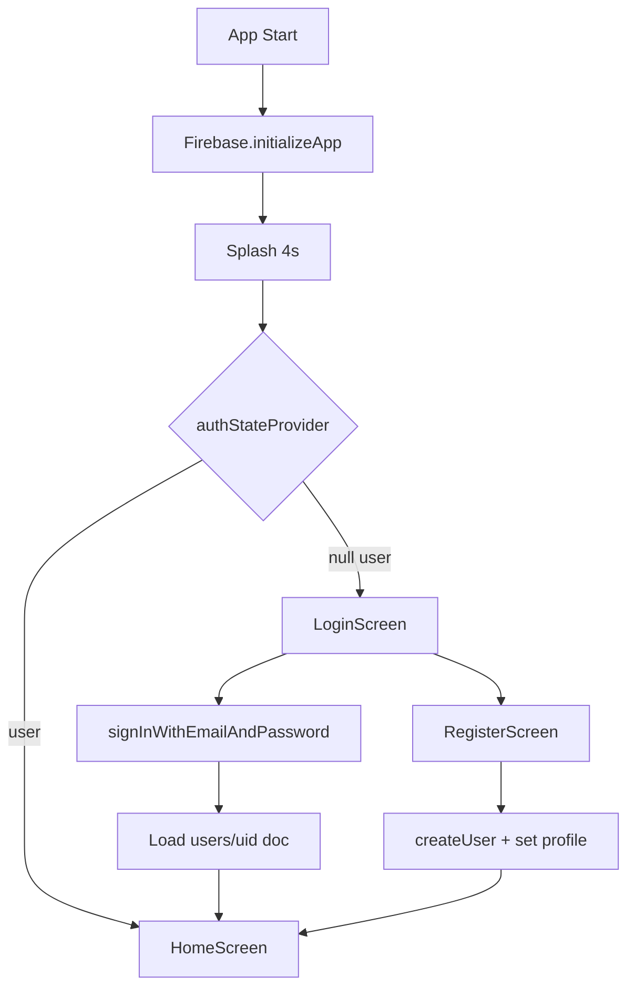

# Volume I — Chapters 1–5

# Phase 1: Complete Project Reverse Engineering

## 1.1 Overall Objective

**HydroSmart** (package name: `hydro_smart`, marketing title: *Hydro Smart — AI-powered Hydroponics Farm Management System*) is an end-to-end digital agriculture platform targeting **soilless (hydroponic) cultivation** in the Indian agro-climatic context. The system's overarching objective is to **close the decision loop** between (a) environmental sensing, (b) agronomic intelligence, (c) economic planning, and (d) farmer-facing guidance—delivered primarily through a **cross-platform Flutter mobile application** backed by **Python microservices** and **Google Firebase** cloud primitives.

Formally, the platform optimizes the mapping:

$$\mathcal{F}: (\mathbf{s}, \mathbf{u}, \mathbf{g}) \rightarrow (\mathbf{c}^*, \mathbf{a}, \mathbf{p})$$

where:
- $\mathbf{s}$ = sensor vector (temperature, humidity, pH, EC, water level, NPK proxies),
- $\mathbf{u}$ = user profile (state, language, farm size, account type),
- $\mathbf{g}$ = geospatial and seasonal context (latitude, month, climate zone),
- $\mathbf{c}^*$ = recommended crop set with compatibility scores,
- $\mathbf{a}$ = actionable advisories (chat, subsidies, finance),
- $\mathbf{p}$ = market price signals.

## 1.2 Real-World Problem Solved

Traditional smallholder and commercial hydroponic operators face:

1. **High cognitive load** in matching crop physiology to controlled-environment parameters.
2. **Fragmented tooling** (spreadsheets, WhatsApp groups, mandi boards) without integration to live sensor data.
3. **Low accessibility** of ML-based agronomy for non-English, mobile-first users.
4. **Financial opacity** in unit economics (nutrients, electricity, labor vs. expected yield).

HydroSmart consolidates these into a **single installable client** with offline-tolerant crop catalogs, optional cloud ML inference, Firebase-backed identity, and retrieval-augmented generative AI for contextual Q&A.

## 1.3 Existing Solutions (Literature & Market)

| Category | Representative Solutions | Limitation Relative to HydroSmart |
|----------|-------------------------|-----------------------------------|
| Generic farm ERP | Agrivi, CropIn | Not hydroponic-parameter-centric |
| IoT dashboards | Blynk, ThingsBoard | Lack integrated crop economics + subsidies |
| Recommender APIs | Academic crop DSS | Rarely ship mobile UX + Indian state-season maps |
| LLM chatbots | ChatGPT generic | No farm-specific RAG grounding in Firestore |
| Mandi apps | eNAM, Agmarknet | No linkage to grower's live pH/humidity |

## 1.4 Research Gap

The literature gap addressed by this project is the **absence of a unified, deployable reference architecture** that simultaneously provides:

- Rule-based **multi-factor crop scoring** (temperature, humidity, pH, season, state),
- **Random Forest** location-aware classification,
- **RAG-grounded** LLM advisory with farmer-readable outputs,
- **Realtime IoT ingestion** via Firebase RTDB,
- **Bilingual UX** and Indian policy modules (subsidies),

in one maintainable monorepo suitable for academic reproducibility.

## 1.5 Innovation

1. **Hybrid recommender:** Flask heuristic engine (`CropRecommendationEngine`) + FastAPI ML (`RandomForestClassifier`) + local JSON fallback (`assets/crop_dataset.json`).
2. **Cyclical temporal features** in ML: $\sin(2\pi m/12)$, $\cos(2\pi m/12)$ for month $m$.
3. **RAG without vector DB:** keyword-overlap retrieval on Firestore `ai_knowledge_base` documents feeding Gemini 2.0 Flash.
4. **Krishi-themed UX system** with onboarding tutorial anchoring (`TutorialStep` + `GlobalKey` spotlight).
5. **Finance hub** with dynamic FY/GST/ROI period selectors tied to Firestore `users/{uid}/finance/monthly`.

## 1.6 Business Value

- **Yield optimization:** faster crop-cycle selection reduces failed batches in NFT/DWC systems.
- **Market timing:** integrated mandi price module (data.gov.in with curated fallback).
- **Compliance awareness:** subsidy catalog with scheme metadata.
- **Retention:** AI assistant + push-ready FCM architecture.

## 1.7 Technical Value

- Demonstrates **clean architecture** boundaries (`domain` / `data` / `features`).
- Provides **dual Python serving patterns** (Flask synchronous + FastAPI async ML).
- Ships **containerized ML** on Render with train-on-build (`render.yaml`).

## 1.8 Social Impact

- Supports **precision agriculture literacy** for youth and small entrepreneurs entering hydroponics.
- **Bilingual** (EN/HI) dashboard strings reduce language barriers.
- Potential extension to **cooperative dashboards** via multi-farm Firestore documents.

---

# Phase 2: Source Code Analysis

## 2.1 Repository Topology

```
hydro_smart/
├── lib/                    # Flutter application (98 Dart modules)
├── backend/                # Flask app.py + Firestore + ml_api duplicate
├── ml_backend/             # Canonical FastAPI ML (Render deploy)
├── assets/                 # crop_dataset.json, TFLite disease model, labels
├── android/, ios/, web/    # Platform runners
├── test/                   # Flutter unit tests
├── docs/RESEARCH_THESIS/   # This document set
└── *.md guides             # RAG, AI, performance, subsidy docs
```

## 2.2 Flutter `lib/` File Encyclopedia

### 2.2.1 Entry Points

| File | Purpose | Key Symbols |
|------|---------|-------------|
| `lib/main.dart` | Production bootstrap: Firebase, splash, auth gate, update overlay | `MyApp`, `AppWithUpdateCheck`, `splashCompleteProvider` |
| `lib/main_new.dart` | Alternate MaterialApp with `AppTheme` only | `MyApp`, `_LoadingScreen` |
| `lib/main_crop_example.dart` | Demo navigator to crop module | `HydroSmartApp`, `HomePage` |
| `lib/firebase_options.dart` | Generated Firebase platform config | `DefaultFirebaseOptions` |

### 2.2.2 Core Layer (`lib/core/`)

| File | Purpose |
|------|---------|
| `config/api_config.dart` | `API_BASE_URL`, endpoint getters for Flask `/api/v1` |
| `constants/app_constants.dart` | App-wide magic numbers and labels |
| `models/update_model.dart` | `AppVersion`, `UpdateState`, `UpdateStatus` enums |
| `providers/update_providers.dart` | `UpdateNotifier`, `autoUpdateCheckProvider` |
| `services/update_service.dart` | Dio version check, APK download via `open_filex` |
| `services/error_handler.dart` | Centralized error presentation helpers |
| `navigation/app_router.dart` | GoRouter configuration (when used) |
| `theme/app_theme.dart` | Royal Indian palette, `ThemeData` light/dark |
| `theme/krishi_theme.dart` | Agricultural green/gold design tokens |
| `theme/krishi_components.dart` | Reusable Krishi UI primitives |
| `theme/warli_painter.dart` | Custom painter for folk-art backgrounds |
| `utils/validators.dart` | Form validation (email, phone) |
| `widgets/update_dialog.dart` | Forced/optional update UI |

### 2.2.3 Data Layer (`lib/data/`)

| File | Purpose |
|------|---------|
| `models/recommendation_model.dart` | `RecommendationModel`, `SeasonalRecommendation`, `CropCategory` |
| `models/user_model.dart` | User profile DTO |
| `models/sensor_model.dart` | Sensor reading structure |
| `repositories/recommendation_repository_impl.dart` | HTTP calls to Flask recommendation APIs |
| `repositories/mock_recommendation_repository.dart` | Offline mock for tests |
| `repositories/auth_repository_impl.dart` | Firebase Auth wrapper |
| `repositories/farm_repository_impl.dart` | Firestore `farms` CRUD |
| `repositories/sensor_repository_impl.dart` | RTDB/Firestore sensor paths |
| `repositories/disease_detection_repository_impl.dart` | TFLite `disease_model.tflite` inference |
| `services/sensor_service.dart` | Sensor history under `sensors/{deviceId}/history` |

### 2.2.4 Domain Layer (`lib/domain/`)

| File | Contract |
|------|----------|
| `repositories/recommendation_repository.dart` | `getRecommendation`, `getMultipleRecommendations`, `evaluateCropCompatibility` |
| `repositories/auth_repository.dart` | Auth abstraction |
| `repositories/disease_detection_repository.dart` | Image → disease label |

### 2.2.5 Feature Modules (`lib/features/`)

| Module | Key Files | Responsibility |
|--------|-----------|----------------|
| `auth/` | `auth_controller.dart`, `login_screen.dart`, `register_screen.dart` | Email/password auth, `users` Firestore profile |
| `splash/` | `splash_screen.dart` | Animated splash, `package_info` version |
| `dashboard/` | `home_screen.dart` | Main hub, drawer, tutorial keys, module shortcuts |
| `crop_recommendation/` | `crop_repository.dart`, `ml_crop_service.dart`, `crop_recommendation_page.dart`, `crop_detail_page.dart` | Catalog, filters, ML + weather |
| `sensors/` | `sensor_provider.dart` | Live telemetry streams |
| `farm/` | `farm_controller.dart`, `farm_setup_screen.dart` | Multi-farm selection |
| `ai_chat/` | `gemini_service.dart`, `chat_controller.dart`, `chat_screen.dart` | RAG + streaming |
| `ai/` | `recommendation_screen.dart`, `disease_detection_screen.dart` | Legacy AI surfaces |
| `finance/` | `finance_screen.dart`, `finance_controller.dart`, `tax_calculator.dart` | P&L, GST, ROI tabs |
| `market_prices/` | `market_price_service.dart`, `market_price_provider.dart` | Mandi + international prices |
| `marketplace/` | `marketplace_screen.dart`, `marketplace_controller.dart` | Product listings (static catalog) |
| `subsidy/` | `subsidy_screen.dart`, `subsidy_detail_page.dart` | Government schemes |
| `growth/` | `growth_screen.dart`, `growth_controller.dart` | Growth tracking |
| `onboarding/` | `onboarding_controller.dart`, `tutorial_overlay.dart`, `animated_character.dart` | Krishi character tutorial |
| `profile/` | `profile_settings_page.dart` | Settings, language |

## 2.3 Backend Python Modules (`backend/`)

| File | Classes / Functions | Role |
|------|---------------------|------|
| `app.py` | Route handlers (16 endpoints) | Flask HTTP surface |
| `crop_database.py` | `CropRecommendationEngine`, `HYDROPONIC_CROPS` | In-memory scoring (~100 crops) |
| `database.py` | `FirestoreDB` | `crops` collection CRUD |
| `pdf_extractor.py` | `CropDataExtractor` | pdfplumber regex extraction |
| `ml_api.py` | FastAPI duplicate of `ml_backend/main.py` | Containerized ML |
| `train_model.py` | `train_and_save`, `generate_synthetic_dataset` | RF training (memory-safe variant) |

## 2.4 ML Backend (`ml_backend/`)

| File | Role |
|------|------|
| `main.py` | FastAPI: `/predict`, `/predict/top`, `/health` |
| `train_model.py` | Production training (`n_estimators=300`, `n_jobs=-1`) |
| `Dockerfile`, `Procfile`, `render_build.sh` | Deployment |

## 2.5 UML — Package Dependency (Mermaid)



## 2.6 Class Diagram — Recommendation Domain



---

# Phase 3: System Architecture

## 3.1 High-Level Architecture



**Architectural style:** **Hybrid cloud-client** with **modular monolith** frontends and **two specialized Python services** (rules + ML). Not microservices in the strict sense—shared Firebase project, independent deploy units.

## 3.2 Low-Level Layering (Flutter)

| Layer | Responsibility | Coupling Rule |
|-------|----------------|---------------|
| Presentation | Widgets, animations, localization toggles | May only call providers |
| Application | Riverpod notifiers, controllers | Orchestrates repositories |
| Domain | Interfaces, pure models | No Firebase/HTTP imports |
| Infrastructure | Repository impls, Dio, SDKs | Implements domain |

## 3.3 Client–Server Sequence (Recommendation)



## 3.4 Deployment Architecture

| Component | Host | Build | Health |
|-----------|------|-------|--------|
| `ml_backend` | Render (`render.yaml`) | `pip install` + `train_model.py` | `GET /health` |
| Flask `app.py` | Manual / Docker (not in render.yaml) | Local venv | `GET /health` |
| Flutter APK | Play Store / sideload | `flutter build apk` | N/A |
| Firebase | Google Cloud | Console | Firebase console |

## 3.5 Network Architecture

- **TLS** assumed for all production HTTP (Render provides HTTPS termination).
- **CORS** enabled on Flask for web clients.
- **No VPN** requirement; public REST + Firebase SDK channels.

---

# Phase 4: Database Analysis

## 4.1 Firestore Collections (Logical ERD)



## 4.2 Realtime Database — Sensor Path

```
devices/{deviceId}/sensors/{sensorId}
  ├── temperature
  ├── humidity
  ├── ph
  ├── timestamp
```

Alternative history path in `sensor_service.dart`:
`sensors/{deviceId}/history`

## 4.3 CRUD Mapping

| Entity | Create | Read | Update | Delete |
|--------|--------|------|--------|--------|
| User profile | Register flow | `auth_controller` stream | Profile settings | Account delete (manual) |
| Farm | `farm_repository_impl.add` | Query by `ownerId` | `update` | `delete` |
| Finance | `set` with merge | `snapshots()` stream | `updateExpense` | N/A |
| Crop (backend) | `add_crop` / PDF | `get_all_crops` | `update_crop` | soft `active:false` |
| Chat config | Admin | `config/gemini_config` | Admin | Admin |

## 4.4 Data Flow Diagram (Level 1)



## 4.5 Security Rules (Recommended Production)

> **Note:** Repository may ship without committed `firestore.rules`. Production must enforce:
> - `users/{uid}`: read/write if `request.auth.uid == uid`
> - `farms`: read/write if `resource.data.ownerId == request.auth.uid`
> - `config/*`: read authenticated; write admin only
> - `ai_knowledge_base`: read authenticated; write admin only

---

# Phase 5: Frontend Analysis (Flutter)

## 5.1 Folder Structure Philosophy

Feature-first under `lib/features/` with shared `core/` and shared `data/`/`domain/` for cross-cutting recommendation and auth concerns. This aligns with **vertical slice** architecture: each feature can evolve independently (e.g., `subsidy` without touching `finance`).

## 5.2 Riverpod Architecture

| Provider Type | Example | Use Case |
|---------------|---------|----------|
| `StateProvider` | `splashCompleteProvider` | Simple flags |
| `StreamProvider` | `authStateProvider`, `financeDataProvider` | Firebase streams |
| `StateNotifierProvider` | `UpdateNotifier`, `MarketPriceNotifier` | Mutable feature state |
| `FutureProvider` | `autoUpdateCheckProvider` | One-shot startup tasks |
| `Provider` | `marketplaceProductsProvider` | Static derived data |

**Dependency rule:** UI `ConsumerWidget` → `ref.watch` read-only; mutations via `ref.read(notifier).method()`.

## 5.3 Routing & Navigation

Primary navigation is **imperative** `Navigator.push` / `MaterialPageRoute` from `HomeScreen` rather than exhaustive `go_router` declarative routes (though `go_router` is a dependency). Entry route determined in `main.dart`:

```
splashComplete == false → SplashScreen
auth loading → CircularProgressIndicator
user == null → LoginScreen
else → AppWithUpdateCheck → HomeScreen
```

## 5.4 Authentication Flow



## 5.5 UI Design System

Dual theme systems coexist:
1. **`AppTheme`** — Royal purple/gold (`royalPurple`, `lotusWhite`) for finance module.
2. **`KrishiTheme`** — Green/golden agricultural motif for dashboard.

Typography leverages `google_fonts` package. Motion: `AnimationController` fade/slide on home; splash shimmer; tutorial character emotions.

## 5.6 Widget Hierarchy (Home Screen)

```
HomeScreen (ConsumerStatefulWidget)
├── Scaffold
│   ├── Drawer / Navigation
│   ├── CustomScrollView / Column
│   │   ├── ProfileHeader (GlobalKey: tutorial)
│   │   ├── MandiPriceStrip (ref.watch marketPriceProvider)
│   │   ├── SensorSummaryCard (sensorProvider)
│   │   ├── FeatureGrid
│   │   │   ├── CropAdvisor → CropRecommendationPage
│   │   │   ├── Finance → FinanceScreen
│   │   │   ├── Marketplace → MarketplaceScreen
│   │   │   ├── Growth → GrowthScreen
│   │   │   ├── AI Chat → ChatScreen
│   │   │   └── Subsidy → SubsidyScreen
│   └── TutorialOverlay (stack)
```

## 5.7 User Journey Map — First-Time Farmer

| Stage | Touchpoint | Success Metric |
|-------|------------|----------------|
| Discover | Play Store / extension | Install |
| Onboard | Splash + Krishi tutorial | Complete 8 tutorial steps |
| Register | Email auth + state selection | Profile doc created |
| Setup farm | Farm setup screen | `farms` document |
| Operate | Sensor card turns green | RTDB data received |
| Decide | Crop recommendation | Compatibility > 70% |
| Monetize | Finance hub | Revenue projection viewed |
| Advise | AI chat | Grounded answer in < 10s |

---

*End of Volume I. Continue with `VOL2_CH06-10_FRONTEND_BACKEND_FIREBASE_AI.md`.*
