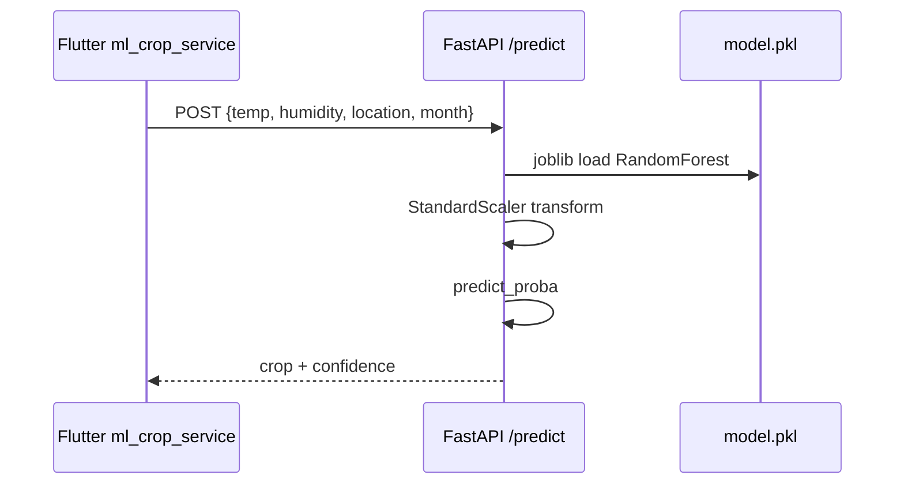
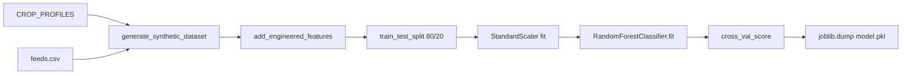
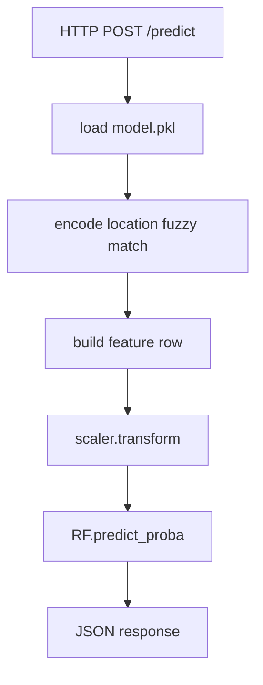
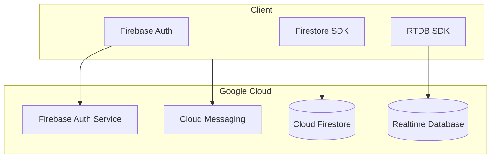
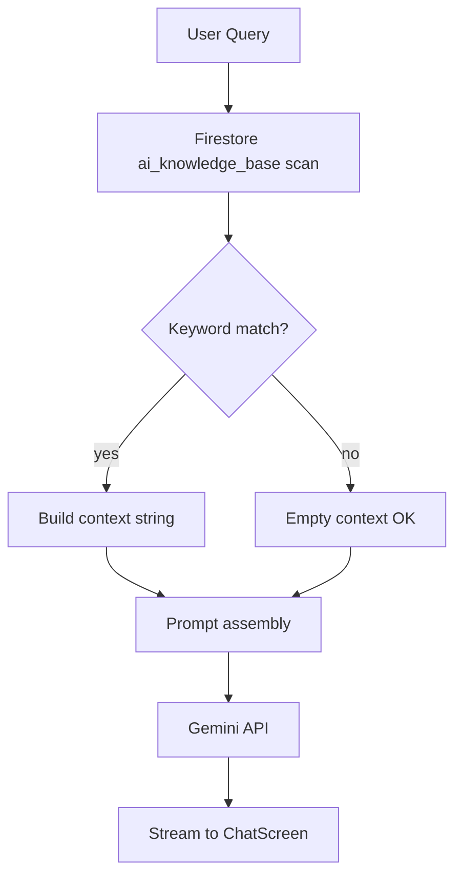
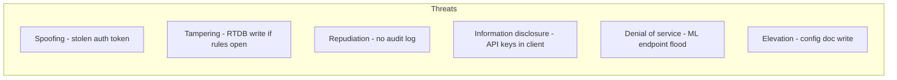
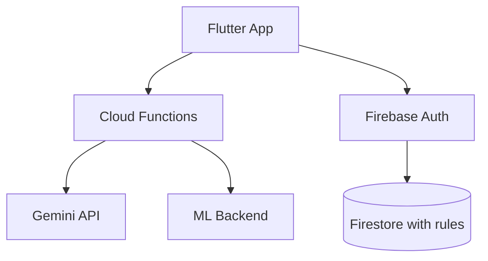

# Volume II — Chapters 6–10

# Phase 6: Backend Analysis (Flask & FastAPI)

## 6.1 Flask Service Architecture

The Flask application (`backend/app.py`) implements a **synchronous WSGI** service on port **5000** with **Flask-CORS** for cross-origin mobile/web clients. Business logic for recommendations is **not** delegated to Firestore at request time; instead, the singleton `recommendation_engine` from `crop_database.py` holds an in-memory dictionary `HYDROPONIC_CROPS` with agronomic metadata for approximately **100 hydroponic-suitable crops**.

Firestore integration (`database.py`) is used primarily for **PDF ingestion persistence** into collection `crops`.

### 6.1.1 Request Processing Pipeline

1. HTTP request deserialized to Python `dict`.
2. Optional validation of numeric ranges (temperature, humidity, pH).
3. `CropRecommendationEngine.calculate_crop_score()` invoked per crop.
4. Sorting by score; top crop or top-N returned as JSON.
5. Exception → HTTP 500 with `{ "error": "..." }`.

## 6.2 Complete Flask Endpoint Catalog

### `GET /health`

| Attribute | Value |
|-----------|-------|
| **Purpose** | Liveness/readiness for orchestrators |
| **Input** | None |
| **Output** | `{ "status": "healthy", "crops_in_database": <int> }` |

**Example response:**
```json
{ "status": "healthy", "crops_in_database": 120 }
```

---

### `POST /api/v1/recommendations`

| Attribute | Value |
|-----------|-------|
| **Purpose** | Single best crop for environmental inputs |
| **Input schema** | `currentTemperature` (°C), `currentHumidity` (%), `currentPh`, optional `farmSize` (m²), `state` (string), `month` (1–12) |
| **Output** | Full `RecommendationModel`-compatible JSON |

**Example request:**
```json
{
  "currentTemperature": 24.5,
  "currentHumidity": 65,
  "currentPh": 6.2,
  "farmSize": 50,
  "state": "Karnataka",
  "month": 6
}
```

**Example response (abbreviated):**
```json
{
  "recommendedCrop": "Tomato",
  "cropEmoji": "🍅",
  "compatibilityScore": 87.4,
  "difficultyLevel": "intermediate",
  "daysToHarvest": 60,
  "temperatureRange": { "min": 20, "max": 28 },
  "phRange": { "min": 5.8, "max": 6.8 }
}
```

---

### `POST /api/v1/recommendations/multiple`

| Attribute | Value |
|-----------|-------|
| **Purpose** | Ranked list for comparison UI |
| **Extra inputs** | `count` (default 10), `category`, `difficulty` |
| **Output** | JSON array of crop objects with `id` field |

---

### `POST /api/v1/recommendations/evaluate`

| Attribute | Value |
|-----------|-------|
| **Purpose** | Score one named crop against current conditions |
| **Input** | `cropName`, `currentTemperature`, `currentHumidity`, `currentPh` |
| **Output** | `{ cropName, cropId, compatibilityScore, isRecommended, temperatureRange, humidityRange, phRange }` |

---

### `POST /api/v1/recommendations/seasonal`

| Attribute | Value |
|-----------|-------|
| **Purpose** | State + month → season + climate zone + crop list |
| **Input** | `state` (default `"Karnataka"`), optional `month` |
| **Output** | `{ state, season, climateZone, estimatedTemperature, recommendations[] }` |

---

### `GET /api/v1/crops` | `GET /api/v1/crops/<crop_id>` | `GET /api/v1/crops/category/<category>`

Catalog operations backed by in-memory engine.

---

### `GET /api/v1/categories` | `GET /api/v1/climate-zones` | `GET /api/v1/states`

Reference data for filter UI (`INDIAN_CLIMATE_ZONES`, `STATE_CLIMATE_MAP`).

---

### `POST /api/v1/upload-crop-pdf`

| Attribute | Value |
|-----------|-------|
| **Purpose** | Extract crop rows from PDF via `CropDataExtractor` |
| **Input** | `multipart/form-data` field `file` |
| **Output** | `{ "saved_crops": N }` |
| **Known defect** | Calls `db.save_crop()` but `FirestoreDB` exposes `add_crop()` — runtime failure until patched |

---

### App Update Endpoints (`/api/app/*`)

| Endpoint | Purpose |
|----------|---------|
| `GET /api/app/version` | Compare semver/build; return `updateAvailable` |
| `GET /api/app/config` | `checkInterval`, `maintenanceMode`, etc. |
| `POST /api/app/update-status` | Telemetry: downloaded/installed/failed |
| `GET /api/app/download` | APK metadata |

**Flutter client** uses Render URL: `https://hydro-smart-d6bimqbnv86c73af8ci0.onrender.com` (see `update_service.dart`). **Note:** Production Render deploy targets `ml_backend` per `render.yaml`; Flask update routes may 404 unless co-deployed.

## 6.3 FastAPI ML Endpoint Catalog (`ml_backend/main.py`)

### `POST /predict`

**Pydantic model `PredictRequest`:**
```python
temperature: float  # -10 to 60
humidity: float     # 0 to 100
location: str       # Indian state name
month: int          # 1-12
```

**Response `PredictResponse`:**
```json
{
  "recommended_crop": "Lettuce",
  "confidence": 78.42,
  "location_used": "Karnataka",
  "input_summary": { "temperature": 18, "humidity": 62, "month": 12 }
}
```

### `POST /predict/top?n=5`

Returns all classes with probability > 1%:
```json
{
  "predictions": [
    { "crop": "Lettuce", "confidence": 45.2 },
    { "crop": "Spinach", "confidence": 22.1 }
  ]
}
```

### `GET /crops` | `GET /locations` | `GET /health` | `GET /`

Service discovery and model metadata (`model_loaded`, `num_crops`, `num_locations`).

## 6.4 API Sequence — ML Prediction



## 6.5 Validation & Error Handling

| Layer | Mechanism |
|-------|-----------|
| FastAPI | Pydantic field constraints (`ge`, `le`) |
| Flask | Manual checks; broad `try/except` → 500 |
| Flutter | `ErrorHandler`, `AsyncValue.error` in Riverpod |
| Dio | `validateStatus` for update check; market API accepts <500 |

---

# Phase 7: AI/ML Analysis

## 7.1 Dataset

### 7.1.1 Synthetic Generation (Primary)

`generate_synthetic_dataset(n_samples=30000)` samples feature vectors from **Gaussian distributions** centered on each crop's ideal temperature and humidity in `CROP_PROFILES` (20 crop classes).

For crop $c$ with ideal temperature $\mu_T^c$ and humidity $\mu_H^c$:

$$T \sim \mathcal{N}(\mu_T^c, \sigma_T^2), \quad H \sim \mathcal{N}(\mu_H^c, \sigma_H^2)$$

Location label drawn from crop-specific state list; month from `months` list.

### 7.1.2 IoT Augmentation (`--feeds feeds.csv`)

Maps ThingSpeak-style fields:
- `field1` → temperature
- `field2` → humidity
- `created_at` → month extraction

Adds ~10% weighted samples to reduce **sim-to-real gap**.

### 7.1.3 Kaggle CSV (`--csv`)

Flexible column mapping for external agronomy datasets.

## 7.2 Feature Engineering

Feature vector $\mathbf{x} \in \mathbb{R}^7$:

| Index | Feature | Formula |
|-------|---------|---------|
| 0 | temperature | $T$ |
| 1 | humidity | $H$ |
| 2 | location_enc | `LabelEncoder(location)` |
| 3 | month | $m \in \{1,\ldots,12\}$ |
| 4 | month_sin | $\sin(2\pi m / 12)$ |
| 5 | month_cos | $\cos(2\pi m / 12)$ |
| 6 | temp_hum_interaction | $T \times H / 100$ |

**Scaling:** `StandardScaler` applied to indices $\{0, 1, 6\}$.

## 7.3 Random Forest — Mathematical Foundation

### 7.3.1 Decision Tree Splitting

For classification, impurity at node $t$ uses **Gini index**:

$$Gini(t) = 1 - \sum_{k=1}^{K} p_k^2(t)$$

where $p_k(t)$ is the proportion of class $k$ at node $t$, $K=20$ crops.

Alternatively, **entropy** (information-theoretic):

$$H(t) = - \sum_{k=1}^{K} p_k(t) \log_2 p_k(t)$$

**Information gain** for split $s$ on feature $X_j$:

$$IG(t, s) = H(t) - \sum_{v \in \{L,R\}} \frac{|t_v|}{|t|} H(t_v)$$

The tree selects $j^*, s^*$ maximizing $IG$ subject to `max_depth`, `min_samples_leaf`.

### 7.3.2 Random Forest Ensemble

Given $B$ trees (e.g., $B=300$), each trained on bootstrap sample $\mathcal{D}_b$ and random feature subset $m \approx \sqrt{p}$:

$$\hat{y}(\mathbf{x}) = \text{mode}\left(\{ h_b(\mathbf{x}) \}_{b=1}^{B} \right)$$

**Confidence** exported to API as $\max_k \hat{p}_k(\mathbf{x})$ from `predict_proba`.

### 7.3.3 Feature Importance

Mean decrease in impurity:

$$\text{Importance}(X_j) = \frac{1}{B}\sum_{b=1}^{B}\sum_{t \in T_b: v(t)=j} p(t) \cdot \Delta i(t)$$

## 7.4 Hyperparameters (Production `ml_backend/train_model.py`)

| Parameter | Value | Rationale |
|-----------|-------|-----------|
| `n_estimators` | 300 | Variance reduction |
| `max_depth` | 18 | Capture climate interactions |
| `min_samples_split` | 4 | Regularization |
| `min_samples_leaf` | 2 | Leaf purity |
| `max_features` | `"sqrt"` | Decorrelate trees |
| `class_weight` | `"balanced"` | Mitigate crop frequency skew |
| `random_state` | 42 | Reproducibility |
| CV folds | 5 | Stratified cross-validation |

## 7.5 Training Workflow



## 7.6 Evaluation Metrics

Reported in training logs:
- **Accuracy** on hold-out set
- **Classification report** (precision, recall, F1 per crop)
- **5-fold CV mean** score

Target stated in docstring: **>85% accuracy** on synthetic+feeds mixture.

## 7.7 Inference Workflow



## 7.8 On-Device Disease Detection (TFLite)

Separate from RF crop recommender:

| Asset | Path |
|-------|------|
| Model | `assets/models/disease_model.tflite` |
| Labels | `assets/labels/labels.txt` |
| Repository | `disease_detection_repository_impl.dart` |

This enables **computer vision** branch for leaf disease classification (Phase 16 expansion).

---

# Phase 8: Firebase Analysis

## 8.1 Authentication

- **Provider:** Email/Password (`firebase_auth`)
- **Persistence:** `Persistence.LOCAL` on web (`main.dart`)
- **Session propagation:** `authStateProvider` → `StreamProvider<User?>`

## 8.2 Firestore Collections (Operational)

| Collection | Document ID | Fields (representative) |
|------------|-------------|-------------------------|
| `users` | `{uid}` | name, phone, state, language, accountType, kisanId |
| `farms` | auto | ownerId, name, area, location |
| `users/{uid}/finance/monthly` | `monthly` | electricityCost, waterCost, nutrientCost, laborCost, estimatedRevenue |
| `crops` | auto | name, emoji, ranges, profit_margin, active, source |
| `ai_knowledge_base` | auto | content, keywords, title |
| `config` | `gemini_config` | apiKey (sensitive) |

## 8.3 Realtime Database

Consumed by `sensor_repository_impl.dart`:

```
devices/{deviceId}/sensors/{sensorId}
```

Enables **sub-second UI updates** on dashboard sensor cards.

## 8.4 Cloud Storage & Messaging

Dependencies declare `firebase_storage` and `firebase_messaging` for media upload workflows and push notifications (infrastructure-ready; feature depth varies by screen).

## 8.5 Firebase Architecture Diagram



## 8.6 Data Synchronization Flow

1. User logs in → Auth token minted.
2. Firestore listeners attach with token in SDK headers.
3. `financeDataProvider` emits on every `monthly` doc change.
4. Sensor RTDB `onValue` → `sensorProvider` invalidates UI.
5. Offline: Firestore SDK caches last snapshot (mobile).

---

# Phase 9: AI Chatbot & RAG Analysis

## 9.1 Gemini Integration

- **Package:** `google_generative_ai`
- **Model:** `gemini-2.0-flash` (`gemini_service.dart`)
- **API key source:** Firestore `config/gemini_config.apiKey` via `chat_controller.dart`

## 9.2 RAG Architecture (Retrieve–Augment–Generate)

Unlike vector-database RAG (Pinecone, Chroma), HydroSmart implements **lightweight lexical RAG**:

### Retrieve
```dart
await _firestore.collection('ai_knowledge_base').limit(10).get();
// Match: keywords.any((k) => query.contains(k)) OR content.contains(query)
```

### Augment
System prompt + concatenated relevant docs + user question.

### Generate
`GenerativeModel.generateContent` or `generateContentStream` for token streaming.

## 9.3 Prompt Engineering Template

```
You are an expert hydroponics farm management AI assistant.
[Context from knowledge base: DOC1, DOC2, ...]
User Question: {query}
Instructions:
- Practical, actionable advice
- Measurements and timeframes
- Cost-effective solutions
Answer:
```

## 9.4 Groq Fallback

`groq_service.dart` mirrors retrieval logic for alternate LLM endpoint when configured—supports **provider redundancy** research extension.

## 9.5 RAG Workflow Diagram



## 9.6 Knowledge Base Design Guidelines

Each document should contain:
- `content`: 200–2000 chars agronomy text
- `keywords`: `["ph", "nutrient", "lettuce"]`
- Optional `title`, `category`, `updatedAt`

**Scaling path:** replace linear scan with Firestore composite indexes + Algolia/Vertex AI Search.

---

# Phase 10: Security Analysis

## 10.1 Authentication & Authorization

| Asset | Control |
|-------|---------|
| User data | Firebase Auth UID scoping |
| Farms | `ownerId` field check (app logic; rules required) |
| Admin config | Must not be client-writable |

## 10.2 Encryption

- **In transit:** TLS 1.2+ (HTTPS, Firebase SDK)
- **At rest:** Google-managed encryption (Firestore/RTDB)
- **Local:** SharedPreferences for update timestamps (non-sensitive)

## 10.3 API Security

| Risk | Mitigation |
|------|------------|
| Open ML endpoint | Rate limiting, API keys (recommended) |
| CORS `*` on Flask | Restrict origins in production |
| APK sideload | Play Protect + signed releases |

## 10.4 OWASP Mobile Top 10 Mapping

| OWASP ID | Exposure | Status |
|----------|----------|--------|
| M1 Improper credential usage | Gemini key in Firestore | **High** — move to Cloud Functions proxy |
| M4 Insufficient input/output validation | Pydantic on ML | Partial |
| M5 Insecure communication | TLS default | OK |
| M9 Insecure data storage | Local caches | Review |

## 10.5 Threat Model (STRIDE)



**Critical recommendation:** Deploy **Firebase Callable Functions** to hold Gemini/ML secrets; never ship keys in client-readable Firestore documents.

## 10.6 Security Architecture (Target State)



---

*End of Volume II. Continue with `VOL3_CH11-15_ENGINEERING_TESTING_PERFORMANCE.md`.*
