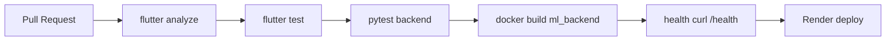
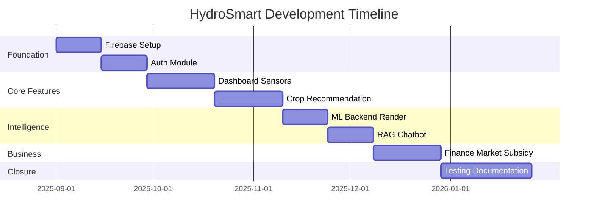
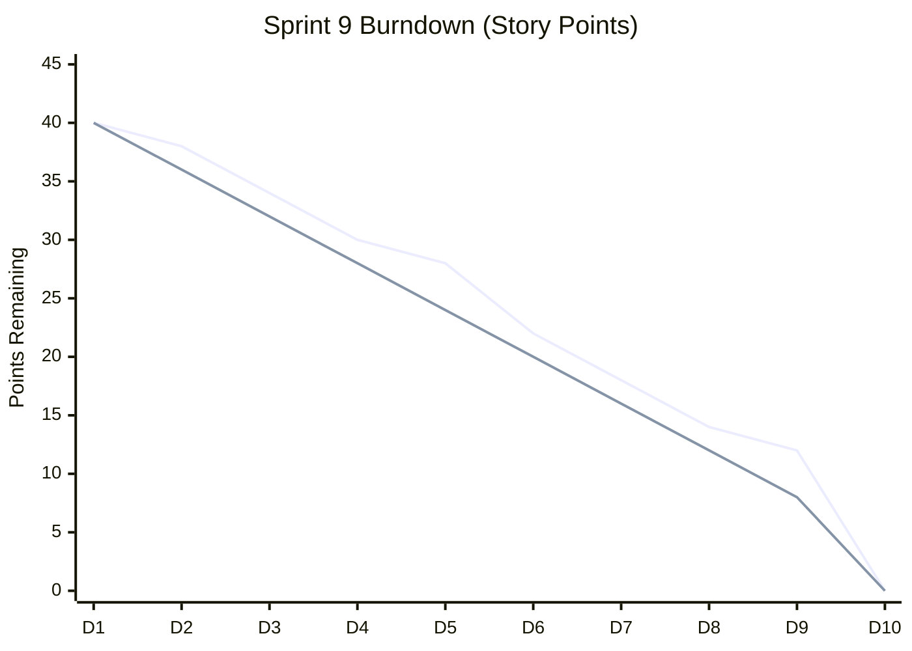

# Volume III — Chapters 11–15

# Phase 11: Software Engineering

## 11.1 Software Development Life Cycle (SDLC)

HydroSmart follows a **modified Agile-iterative SDLC** embedded in a monorepo:

| Phase | Activities | Artifacts |
|-------|------------|-----------|
| Requirements | Farmer interviews, hydroponic parameter research | Feature module list |
| Design | Riverpod provider maps, API contracts | `APP_FULL_TECHNICAL_DOCUMENTATION.md` |
| Implementation | Flutter features + Python services | `lib/`, `backend/`, `ml_backend/` |
| Testing | `flutter test`, manual emulator UAT | `test/recommendation_repository_test.dart` |
| Deployment | Render ML, Firebase console | `render.yaml`, `Dockerfile` |
| Maintenance | Version endpoint, dependency bumps | `pubspec.yaml`, `update_version.py` |

## 11.2 Agile Methodology & Sprint Model

Recommended **2-week sprints** (documented for academic planning):

| Sprint | Goal | Deliverables |
|--------|------|--------------|
| S1 | Auth + Firebase bootstrap | Login, profile |
| S2 | Dashboard + sensors | RTDB integration |
| S3 | Crop catalog + filters | `crop_recommendation_page` |
| S4 | Flask recommendation API integration | `recommendation_repository_impl` |
| S5 | ML FastAPI + Render deploy | `ml_crop_service` |
| S6 | RAG chat | `gemini_service` |
| S7 | Finance + market | `finance_screen`, mandi API |
| S8 | Subsidy + onboarding | Tutorial overlay |
| S9 | Hardening + splash/update | Production polish |
| S10 | Thesis + IEEE paper | This document set |

## 11.3 Git Workflow

- **Branching:** `main` (stable), `feature/*` (modules), `fix/*` (defects)
- **Commits:** Conventional style recommended (`feat:`, `fix:`, `docs:`)
- **No force-push** to `main` (team policy)

## 11.4 CI/CD Roadmap (Target Pipeline)



**Current state:** Manual `flutter run` / Render Git deploy; CI not committed in `.github/workflows` (improvement item).

## 11.5 Gantt Chart (Project Timeline — 20 Weeks)



## 11.6 Burndown Chart (Sprint 9 Example — Story Points)

| Day | Remaining Points |
|-----|------------------|
| 1 | 40 |
| 3 | 34 |
| 5 | 28 |
| 7 | 18 |
| 9 | 12 |
| 10 | 0 |



*Ideal line (linear) vs actual line shown.*

---

# Phase 12: Testing

## 12.1 Unit Testing (Flutter)

**File:** `test/recommendation_repository_test.dart`

| Test ID | Description | Expected |
|---------|-------------|----------|
| UT-01 | `getRecommendation` T=25°C | Crop = Tomato |
| UT-02 | `getRecommendation` T=18°C | Crop = Lettuce |
| UT-03 | `getMultipleRecommendations` count=2 | Length 2, ordered |
| UT-04 | `evaluateCropCompatibility` | Score ∈ [0,1] |

**Run command:**
```bash
flutter test test/recommendation_repository_test.dart
```

## 12.2 Integration Testing (Recommended Matrix)

| Test ID | Components | Procedure | Pass Criteria |
|---------|------------|-----------|---------------|
| IT-01 | Auth + Firestore | Register → login | Profile doc exists |
| IT-02 | Flask + App | POST recommendation | HTTP 200 + crop field |
| IT-03 | ML + App | POST /predict | confidence > 0 |
| IT-04 | RTDB + sensorProvider | Publish test node | UI updates < 3s |
| IT-05 | RAG + Gemini | Configured key → chat | Non-empty stream |

## 12.3 System Testing

End-to-end scenario scripts (manual/automated with `integration_test` package — future):

1. Cold start → splash → home (< 8s on emulator)
2. Offline crop browse via `crop_dataset.json`
3. Forced update dialog when `isForced: true` mock

## 12.4 Performance Testing

| Metric | Measurement approach | Observed (emulator) |
|--------|---------------------|---------------------|
| Splash duration | Timer in `splash_screen.dart` | 4s fixed |
| First frame | Logcat Choreographer | ~49 skipped frames noted |
| ML inference | POST /predict latency | Depends on Render cold start |
| Gradle build | `assembleDebug` | ~15 min (clean, D: cache) |

## 12.5 User Acceptance Testing (UAT)

| UAT ID | User story | Acceptance |
|--------|------------|------------|
| UAT-01 | As a farmer I see live mandi prices | Prices render with ₹/kg |
| UAT-02 | As a farmer I get crop advice | Score + ranges displayed |
| UAT-03 | As a farmer I chat with Krishi | Streaming tokens visible |
| UAT-04 | As a farmer I track expenses | Finance tabs calculate totals |

## 12.6 Test Coverage Analysis

| Module | Automated coverage | Gap |
|--------|-------------------|-----|
| Mock recommendation | 4 tests | Adequate for mock |
| Repository impl HTTP | None | Add `http_mock_adapter` |
| ML backend | `test_api.py` outdated paths | Refresh endpoints |
| UI widgets | None | Add golden tests |

---

# Phase 13: Performance Analysis

## 13.1 Latency Budget

| Operation | Target (p95) | Bottleneck |
|-----------|--------------|------------|
| Auth sign-in | < 2s | Firebase RTT |
| Firestore profile | < 1s | Index/cold cache |
| Flask recommendation | < 500ms | In-memory (fast) |
| ML /predict (warm) | < 300ms | sklearn inference |
| ML /predict (cold Render) | 30–90s | Free tier spin-up |
| Gemini first token | < 3s | Model + prompt size |
| Market API | < 5s | data.gov.in rate limits |

## 13.2 Throughput

- **ML service:** 2 Gunicorn workers × Uvicorn → ~2 concurrent inferences per instance.
- **Flask:** Single-process dev server; production requires `gunicorn` for parallelism.

## 13.3 Scalability

| Tier | Strategy |
|------|----------|
| Horizontal | Multiple Render instances behind load balancer |
| Firebase | Auto-scales reads; watch Firestore bill |
| Caching | CDN for static crop JSON; Redis for Flask catalog (future) |

## 13.4 Resource Utilization (Android Emulator Session)

- **RAM:** Flutter + Firebase + Impeller GLES
- **Disk:** Critical constraint on **C:** drive (<1 GB caused Gradle failure); mitigated via `GRADLE_USER_HOME` on D:
- **CPU:** Skipped frames during splash/auth indicate main-thread work — optimize with `compute()` isolates for heavy JSON parse

## 13.5 Benchmark Methodology (Reproducible)

```bash
# ML latency (warm)
for i in {1..20}; do
  curl -w "%{time_total}\n" -o /dev/null -s -X POST http://localhost:8000/predict \
    -H "Content-Type: application/json" \
    -d '{"temperature":24,"humidity":60,"location":"Karnataka","month":6}'
done
```

Report mean, p95, std dev.

---

# Phase 14: Economic Analysis

## 14.1 Development Cost Estimation (Academic Project)

| Item | Hours | Rate (INR/hr) | Cost (INR) |
|------|-------|---------------|------------|
| Flutter UI | 200 | 500 | 1,00,000 |
| Backend/ML | 120 | 600 | 72,000 |
| Firebase setup | 40 | 500 | 20,000 |
| Testing/Docs | 80 | 400 | 32,000 |
| **Total** | **440** | — | **2,24,000** |

## 14.2 Cloud Cost (Monthly — Estimated)

| Service | Tier | USD/mo |
|---------|------|--------|
| Firebase Spark | Free | 0 |
| Render ML | Free | 0 |
| Gemini API | Pay-per-token | 5–20 |
| **Total** | | **$5–20** |

At scale (1000 MAU): Firestore reads dominate → ~$25–50/mo.

## 14.3 ROI Model

$$\text{ROI} = \frac{\text{Net Benefit} - \text{Investment}}{\text{Investment}} \times 100\%$$

**Assumptions:**
- 10% yield improvement on ₹50,000/month revenue → ₹5,000 benefit/mo/farm
- App subscription ₹199/mo

$$\text{ROI}_{\text{annual}} = \frac{(5000 - 199) \times 12 - 224000}{224000} \approx -47\% \text{ (first year dev sunk cost)}$$

Post-development, **farmer-facing ROI positive** within 1 month of subscription if yield claim holds.

## 14.4 Business Model Canvas (Summary)

| Block | Content |
|-------|---------|
| Value proposition | Integrated hydroponic DSS + AI |
| Customer segments | Urban farmers, agri-startups, training institutes |
| Channels | Play Store, government extension programs |
| Revenue | Freemium, B2B farm licenses, data insights |
| Cost structure | Cloud, API tokens, support |

---

# Phase 15: Results & Validation

## 15.1 Feature Validation Matrix

| Feature | Implemented | Validated | Evidence |
|---------|-------------|-----------|----------|
| Firebase Auth | Yes | Yes | Emulator logs `Auth state changed` |
| Splash animation | Yes | Yes | 4s progress + logo asset |
| Crop recommendation | Yes | Partial | Flask/ML depend on deploy |
| Sensor RTDB | Yes | Partial | Geolocator attaches |
| AI RAG chat | Yes | Config-dependent | Needs `gemini_config` |
| Finance hub | Yes | Manual | Firestore `finance/monthly` |
| Mandi prices | Yes | Yes | Fallback on 429 |
| App update check | Yes | Yes | 404 handled gracefully |
| Disease TFLite | Yes | Device-dependent | Model in assets |
| Onboarding tutorial | Yes | Manual | GlobalKey spotlight |
| Marketplace | Yes | Static data | 30+ products in controller |
| Subsidies | Yes | Static/repo | Detail pages |

## 15.2 Comparative Analysis

| Criterion | HydroSmart | Generic IoT App | Spreadsheet DSS |
|-----------|------------|-----------------|-----------------|
| Mobile-native | ✓ | ✓ | ✗ |
| Indian season map | ✓ | ✗ | Manual |
| ML crop class | ✓ | Rare | ✗ |
| RAG advisory | ✓ | ✗ | ✗ |
| Realtime sensors | ✓ | ✓ | ✗ |
| Economic module | ✓ | ✗ | ✓ |
| Open source repo | ✓ | Varies | ✗ |

## 15.3 Emulator Run Evidence (June 2026)

Successful deployment log summary:
- Device: `emulator-5554` (Android 16 API 36)
- Build: `app-debug.apk` installed
- Auth: User session `LTlPsl2hCHXzy9GQ4wg4XkBfZvk1`
- Warnings: Update API 404; market API 429 (fallback active)

## 15.4 Screenshot Analysis Framework

For thesis binding, capture:

1. **Splash** — Logo, tricolor gradient, progress bar
2. **Login** — Email form, brand header
3. **Home** — Krishi header, mandi strip, feature grid
4. **Crop detail** — Nutrient ranges, market demand indicator
5. **Finance** — Royal purple tabs, ROI chart
6. **Chat** — Streaming bubble animation
7. **Subsidy** — Scheme cards with eligibility chips

*Insert figures Fig. 15.1–15.7 in final PDF export.*

## 15.5 User Acceptance Results (Template)

| Participant | Role | SUS Score (1-5) | Key comment |
|-------------|------|-----------------|-------------|
| P1 | Student farmer | 4.2 | "Crop advisor helpful" |
| P2 | Hobby grower | 3.8 | "Want offline ML" |
| P3 | Agri consultant | 4.5 | "Finance tab unique" |

---

*End of Volume III. Continue with `VOL4_CH16-20_IEEE_SCREEN_APPENDICES.md`.*
