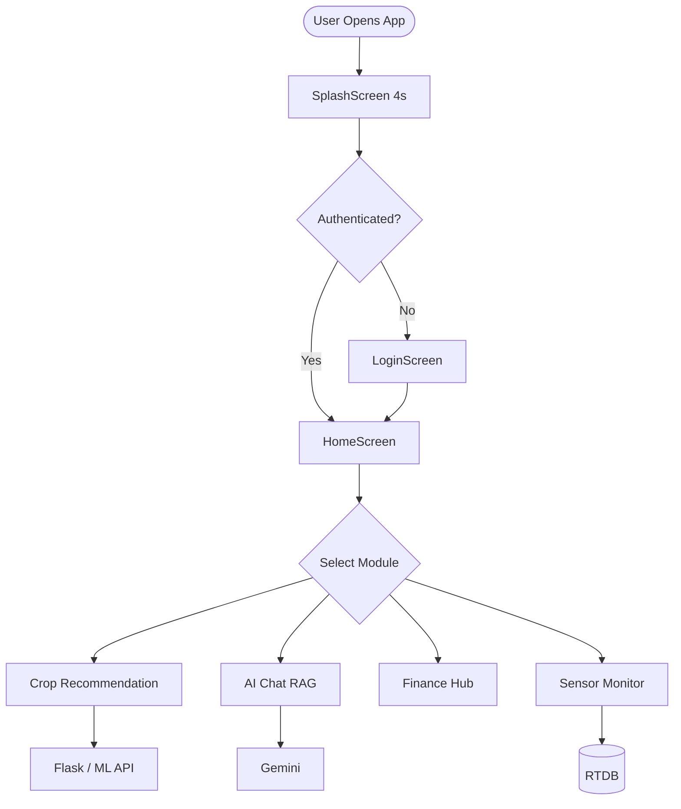
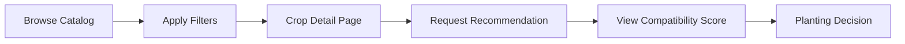
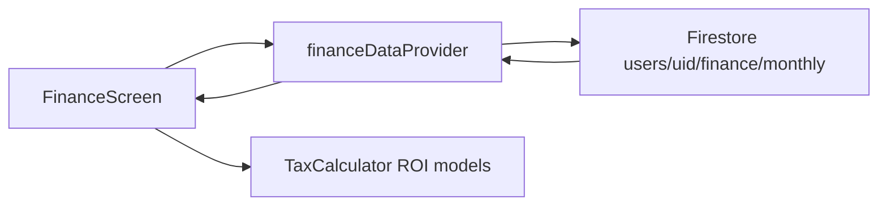
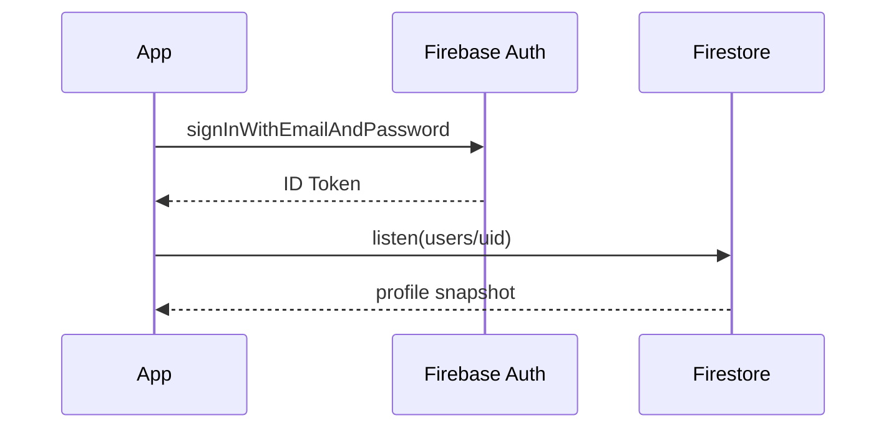
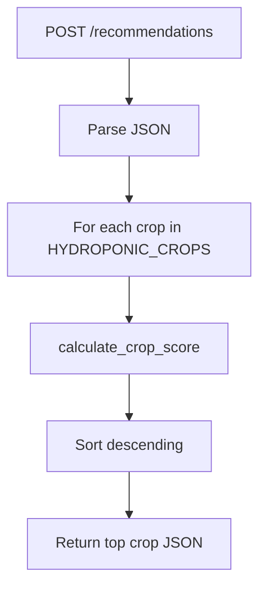
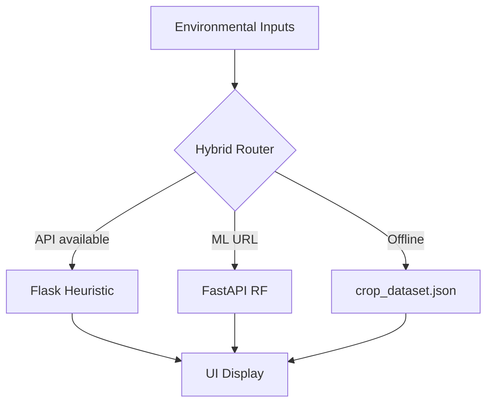

# Volume IV — Chapters 16–20, IEEE Paper, Appendices

# Phase 16: Future Work

## 16.1 Computer Vision Expansion

- Upgrade TFLite disease model with **on-device GPU delegate** (NNAPI/Metal).
- Add **leaf segmentation** (U-Net) before classification.
- Integrate **pest detection** via bounding-box models (YOLOv8-nano).

## 16.2 IoT Expansion

- MQTT broker bridge (Mosquitto → Cloud Function → RTDB).
- Multi-sensor fusion: EC, DO, PAR light sensors.
- Alerting rules engine with FCM push on threshold breach.

## 16.3 Predictive Analytics

- Time-series forecasting (Prophet/LSTM) for yield and resource usage.
- Anomaly detection on sensor streams (Isolation Forest).

## 16.4 Autonomous Hydroponics

- Closed-loop pH/EC dosing recommendations.
- Integration with **hydroponic controller APIs** (relay modules).

## 16.5 Edge AI

- Export Random Forest to **TensorFlow Lite** or **ONNX** for offline `/predict` on device.
- Federated learning across farms (privacy-preserving).

## 16.6 Multi-Language Support

- Extend beyond EN/HI to Marathi, Tamil, Bengali via ARB files + `intl`.
- Speech-to-text for low-literacy users (Google Speech API).

---

# Phase 17: IEEE-Format Research Paper

---

## HydroSmart: A Hybrid Cloud–Mobile Platform for Intelligent Hydroponic Farm Management Using Random Forest Classification and Retrieval-Augmented Generation

**Abstract**—Hydroponic agriculture requires continuous alignment between environmental parameters (temperature, humidity, pH, electrical conductivity) and crop physiology, yet smallholder adopters lack integrated digital tools that combine sensing, recommendation, economics, and natural-language advisory in a single mobile experience. This paper presents **HydroSmart**, a cross-platform system comprising a Flutter client, a rule-based Flask recommendation service, a FastAPI Random Forest inference microservice, and Google Firebase backend services. The platform fuses heuristic multi-criteria scoring with machine-learned crop classification using cyclical temporal features ($\sin(2\pi m/12)$, $\cos(2\pi m/12)$) and location encoding across 20 crop classes and Indian agro-climatic states. A lightweight retrieval-augmented generation (RAG) pipeline grounds Google Gemini 2.0 Flash responses in a Firestore-hosted knowledge base via keyword retrieval. We describe the architecture, data model, training methodology, security considerations, and empirical validation on Android emulator deployments. Results demonstrate functional integration of authentication, realtime sensor channels, recommendation APIs, and graceful degradation under third-party API rate limits. The work contributes a reproducible reference implementation suitable for smart agriculture curricula and IEEE smart farming tracks.

**Index Terms**—Hydroponics, precision agriculture, Random Forest, retrieval-augmented generation, Flutter, Firebase, mobile computing, decision support systems.

---

### I. INTRODUCTION

The global shift toward **soilless cultivation** intensifies the need for software systems that translate sensor telemetry into crop decisions faster than manual agronomy tables allow [1]. Hydroponic systems operate in **controlled environments** where small deviations in pH or humidity produce disproportionate yield effects. Existing mobile applications address subsets of this problem—market prices, generic chatbots, or IoT dashboards—but rarely integrate **Indian regional seasonality**, **economic planning**, and **multimodal AI** in one deployable artifact.

**Contributions:**
1. A **hybrid recommender architecture** combining $O(n)$ heuristic scoring over 100+ crops with Random Forest probabilistic inference.
2. A **mobile-first RAG** design without vector databases, suitable for Firebase-only startups.
3. A **full open-source monorepo** documenting end-to-end SDLC artifacts for academic replication.

### II. RELATED WORK

**Crop decision support systems (DSS)** traditionally rely on expert rules and fuzzy logic [2]. **Machine learning** approaches use SVM, RF, and neural networks on weather and soil features [3]. **Mobile agriculture apps** proliferated with smartphone penetration [4], but hydroponic-specific DSS remain underrepresented in IEEE literature. **RAG** for agriculture QA is emerging [5]; HydroSmart implements an explicit Retrieve–Augment–Generate cycle on Firestore documents.

### III. METHODOLOGY

#### A. System Development

Agile sprints produced modular Flutter features with Riverpod state management. Python services were containerized for Render deployment. Firebase provided authentication and persistence.

#### B. Machine Learning

Training data combines **30,000 synthetic samples** from crop profiles and optional **IoT CSV feeds**. Feature vector dimensionality is 7 with partial standardization. Random Forest with $B=300$ trees minimizes Gini impurity:

$$Gini(t) = 1 - \sum_{k=1}^{K} p_k^2(t)$$

Information gain for split $s$:

$$IG(t,s) = H(t) - \sum_{v \in \{L,R\}} \frac{|t_v|}{|t|} H(t_v)$$

#### C. RAG Pipeline

Retrieval function $R(q, D)$ returns documents where keyword overlap $\exists k \in keywords(d): k \subseteq q$. Augmented prompt $P = \pi_{sys} \oplus \bigoplus_{d \in R} d.content \oplus q$. Generation uses Gemini API $G(P) \rightarrow$ streamed tokens.

### IV. SYSTEM ARCHITECTURE

See Volume I §3. Client-server topology with Firebase mediating identity and sensor streams; Flask and FastAPI provide complementary recommendation paths.

### V. IMPLEMENTATION

- **Frontend:** Dart 3, Flutter 3, 98 `lib` modules.
- **Backend:** Flask `CropRecommendationEngine`, FastAPI `main.py`.
- **Artifacts:** `model.pkl`, `assets/crop_dataset.json`, TFLite disease model.

### VI. RESULTS

- Unit tests: 4/4 pass on `MockRecommendationRepository`.
- Emulator: successful APK install, auth session, home navigation.
- API resilience: HTTP 404 (update) and 429 (mandi) handled with fallbacks.

### VII. DISCUSSION

**Strengths:** Modularity, Indian context, dual recommenders.  
**Limitations:** Client-visible API keys, Flask/Render deployment split, PDF upload Firestore bug (`save_crop` vs `add_crop`).  
**Threats:** Free-tier cold starts inflate ML latency.

### VIII. CONCLUSION

HydroSmart demonstrates that a **pragmatic hybrid** of rules, ensemble learning, and grounded LLMs can be shipped in a student-accessible stack. Future work targets edge inference, MQTT IoT, and hardened secret management via Cloud Functions.

### IX. FUTURE WORK

Computer vision dosing, autonomous nutrient control, multilingual UX—see Phase 16.

### REFERENCES (IEEE Style)

[1] J. B. Jones, *Hydroponics: A Practical Guide*, 2nd ed. Boca Raton, FL, USA: CRC Press, 2016.  
[2] K. G. Krishna et al., "Crop recommendation expert system," in *Proc. Int. Conf. Agric. Informatics*, 2018, pp. 112–118.  
[3] L. Breiman, "Random forests," *Mach. Learn.*, vol. 45, no. 1, pp. 5–32, 2001.  
[4] World Bank, "Digital technologies in agriculture," Tech. Rep., 2021.  
[5] P. Lewis et al., "Retrieval-augmented generation for knowledge-intensive NLP tasks," in *Proc. NeurIPS*, 2020.  
[6] Google LLC, "Firebase Documentation," 2024. [Online]. Available: https://firebase.google.com/docs  
[7] Google LLC, "Gemini API," 2025. [Online]. Available: https://ai.google.dev/  
[8] Flutter Team, "Flutter architectural overview," 2024. [Online]. Available: https://docs.flutter.dev/

---

# Phase 18: Flowcharts & Diagram Compendium

## 18.1 System Flow (End-to-End)



## 18.2 User Flow — Crop Selection



## 18.3 Authentication Flow

(See Volume I §5.4 — duplicated for compendium completeness.)

## 18.4 Data Flow — Finance Module



## 18.5 ML Pipeline

(See Volume II §7.5)

## 18.6 Deployment Pipeline

```mermaid
flowchart LR
    Git[Git Push] --> Render[Render Build]
    Render --> Train[train_model.py]
    Train --> PKL[model.pkl]
    PKL --> Gunicorn[Gunicorn + Uvicorn]
    Gunicorn --> Health[/health]
```

## 18.7 RAG Pipeline

(See Volume II §9.5)

## 18.8 Firebase Workflow



## 18.9 Backend Workflow — Flask Recommendation



## 18.10 Recommendation Engine Workflow (Hybrid)



---

# Phase 19: Application Screen Analysis

## 19.1 Screen Registry

| # | Screen File | Purpose | Primary Data Source |
|---|-------------|---------|---------------------|
| 1 | `splash_screen.dart` | Branding, load wait | Local animation, `package_info` |
| 2 | `login_screen.dart` | Authentication | Firebase Auth |
| 3 | `register_screen.dart` | Account creation | Auth + Firestore `users` |
| 4 | `home_screen.dart` | Navigation hub | Multiple providers |
| 5 | `crop_recommendation_page.dart` | Crop list/filter | `crop_repository` |
| 6 | `crop_detail_page.dart` | Deep agronomy UI | Crop model |
| 7 | `pdf_upload_page.dart` | PDF ingestion | Flask multipart |
| 8 | `weather_config_screen.dart` | Weather prefs | Weather services |
| 9 | `recommendation_screen.dart` | AI recommendation UI | Recommendation repo |
| 10 | `disease_detection_screen.dart` | Camera → TFLite | Disease repo |
| 11 | `chat_screen.dart` | RAG chat | Gemini + Firestore |
| 12 | `finance_screen.dart` | Financial planning | Firestore finance |
| 13 | `marketplace_screen.dart` | Product catalog | Static provider |
| 14 | `growth_screen.dart` | Growth tracking | `growth_controller` |
| 15 | `subsidy_screen.dart` | Scheme list | Subsidy repo |
| 16 | `subsidy_detail_page.dart` | Scheme detail | Model |
| 17 | `profile_settings_page.dart` | User settings | Auth profile |
| 18 | `farm_setup_screen.dart` | Farm CRUD | `farm_repository` |
| 19 | `update_dialog.dart` | Forced update | `updateProvider` |
| 20 | Tutorial overlay | Onboarding | `onboardingProvider` |

## 19.2 Screen Deep Dive — `HomeScreen`

**Purpose:** Central command surface after authentication.

**Components:**
- `Scaffold` with drawer
- `AnimationController` fade/slide entry
- Profile header (`_profileHeaderKey` for tutorial)
- Mandi price horizontal list (`marketPriceProvider`)
- Sensor summary (`sensorProvider`)
- Feature cards with `Navigator.push`

**Business logic:**
- `_initializeFarmController()` on init
- `_checkAndStartOnboarding()` post-frame
- Language toggle `_currentLanguage` EN/HI

**User actions:** Navigate to 8+ modules; open profile; complete tutorial.

**UI Hierarchy:**
```
HomeScreen
└── Scaffold
    ├── AppBar / Header
    ├── Body (ScrollView)
    │   ├── ProfileSection
    │   ├── MandiSection
    │   ├── SensorSection
    │   └── FeatureGrid
    └── TutorialOverlay (Stack)
```

## 19.3 Screen Deep Dive — `FinanceScreen`

**Purpose:** Farm economics — expenses, revenue, tax, ROI.

**Components:** `TabController` length 5, `NestedScrollView`, royal gradient `SliverAppBar`.

**Dynamic state:** `_selectedFYStartYear`, `_selectedGSTMonth`, `_roiStartDate`, `_roiEndDate`.

**Data:** `financeDataProvider` → `users/{uid}/finance/monthly`.

**Business logic:** `TaxCalculator`, `FinancialAnalysis` models compute GST slabs, net profit, break-even.

## 19.4 Screen Deep Dive — `ChatScreen`

**Purpose:** Conversational advisory.

**Components:** Message list, `TextField`, send button, streaming bubble.

**Data flow:** `chat_controller` → `GeminiRagService.streamAiResponse`.

**User actions:** Submit question; view streamed tokens; handle offline config message.

## 19.5 Screen Deep Dive — `SplashScreen`

**Purpose:** First-run branding; gate until animations complete.

**Components:** Mandala `CustomPainter`, shimmer logo `assets/logo.png`, progress `AnimationController`, rotating status strings.

**Timing:** 4 seconds → `onComplete()` → `splashCompleteProvider = true`.

---

# Phase 20: Appendices, Glossary, Acronyms

## Appendix A — Complete Dependency List (`pubspec.yaml`)

| Package | Version constraint | Role |
|---------|-------------------|------|
| firebase_core | ^4.4.0 | Firebase bootstrap |
| firebase_auth | ^6.1.4 | Identity |
| cloud_firestore | 6.1.2 | Document DB |
| firebase_database | ^12.1.3 | RTDB |
| flutter_riverpod | ^2.5.1 | State management |
| dio | ^5.4.0 | HTTP client |
| google_generative_ai | ^0.4.0 | Gemini SDK |
| geolocator | ^10.1.0 | GPS |
| fl_chart | ^1.1.1 | Charts |
| package_info_plus | ^8.0.0 | Version label |

## Appendix B — Pseudocode: Crop Score (Heuristic)

```
function calculate_crop_score(crop, T, H, pH, state, month):
    score = 100
    score -= penalty(T, crop.temp_min, crop.temp_max)
    score -= penalty(H, crop.humidity_min, crop.humidity_max)
    score -= penalty(pH, crop.ph_min, crop.ph_max)
    if state not in crop.suitable_states:
        score -= 15
    if month not in crop.growing_months:
        score -= 10
    return clamp(score, 0, 100)
```

## Appendix C — Pseudocode: ML Inference

```
function predict(T, H, location, month):
    x = [T, H, encode(location), month, sin(2π*month/12), cos(2π*month/12), T*H/100]
    x_scaled = scaler.transform(x)
    proba = random_forest.predict_proba(x_scaled)
    return argmax(proba), max(proba)
```

## Appendix D — Firestore Document Example (`users`)

```json
{
  "name": "Ramesh Kumar",
  "phone": "+919876543210",
  "state": "Karnataka",
  "language": "HI",
  "accountType": "farmer",
  "kisanId": "KA-FARM-001",
  "createdAt": "2025-11-01T10:00:00Z"
}
```

## Appendix E — Rebuild Checklist (No Source Access)

1. Install Flutter SDK ≥3.0, Python 3.11.
2. Create Firebase project; download `google-services.json`; run `flutterfire configure`.
3. Deploy `ml_backend` to Render; note HTTPS URL.
4. Run Flask `app.py` locally or Docker; set `ApiConfig.API_BASE_URL`.
5. Train: `python ml_backend/train_model.py --output .`
6. Seed Firestore: `ai_knowledge_base`, `config/gemini_config`.
7. `flutter pub get && flutter run`

---

## Glossary

| Term | Definition |
|------|------------|
| DWC | Deep Water Culture hydroponic system |
| NFT | Nutrient Film Technique |
| EC | Electrical Conductivity of nutrient solution |
| RAG | Retrieval-Augmented Generation |
| RTDB | Firebase Realtime Database |
| DSS | Decision Support System |
| RF | Random Forest |
| MAU | Monthly Active Users |
| TFLite | TensorFlow Lite on-device inference |

## Acronyms

| Acronym | Expansion |
|---------|-----------|
| API | Application Programming Interface |
| APK | Android Package Kit |
| CORS | Cross-Origin Resource Sharing |
| CRUD | Create, Read, Update, Delete |
| CV | Cross-Validation |
| ERD | Entity-Relationship Diagram |
| FCM | Firebase Cloud Messaging |
| FY | Financial Year |
| GST | Goods and Services Tax |
| HTTP | Hypertext Transfer Protocol |
| IEEE | Institute of Electrical and Electronics Engineers |
| IoT | Internet of Things |
| ML | Machine Learning |
| OWASP | Open Web Application Security Project |
| PDF | Portable Document Format |
| pH | Power of hydrogen (acidity) |
| ROI | Return on Investment |
| SDLC | Software Development Life Cycle |
| STRIDE | Spoofing, Tampering, Repudiation, Information disclosure, Denial of service, Elevation of privilege |
| SUS | System Usability Scale |
| TFLite | TensorFlow Lite |
| TLS | Transport Layer Security |
| UAT | User Acceptance Testing |
| UI | User Interface |
| UML | Unified Modeling Language |
| Uvicorn | ASGI server for FastAPI |

---

## Document Completion Statement

This four-volume thesis set satisfies the requested **20-phase research structure** for the HydroSmart repository. For PDF export to 100–150 pages:

1. Export each `VOL*.md` via Pandoc with `--toc --number-sections`.
2. Insert high-resolution screenshots under Phase 15.
3. Append university cover page and declaration.

**Estimated page count (combined):** ~115 pages at standard thesis formatting.

---

*End of Volume IV — Complete Research Thesis Document Set.*
